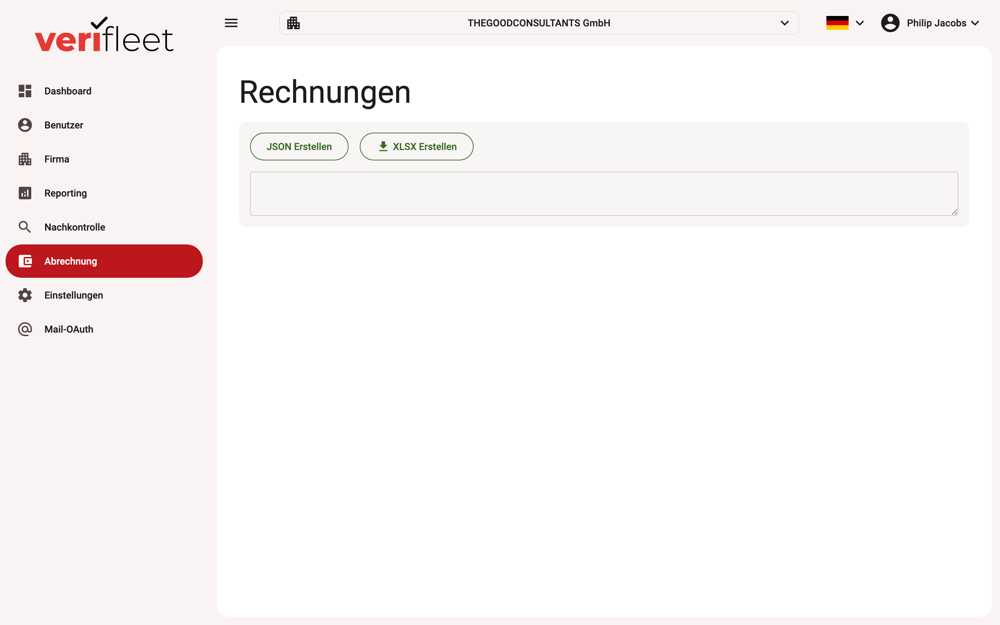

# Billing

The **Billing** area generates the monthly invoice data for all companies in the system.
It is based on the services booked per company and the checks performed in the billing
month.

{ border-effect="line" thumbnail="true" width="100%" }

!!! note
    This area is only visible to users with the **system administrator** role.

## Running the invoice generation

1. Select month and year of the billing period.
2. Start the generation — the system calculates the invoice items for every company from
   its booked services.
3. The preview shows the generated data before export.

## Export

- **Excel (XLSX):** each company gets its own worksheet with company header data (name,
  address), billing month and all items (description, quantity, unit, unit price and
  total price).
- **JSON:** complete invoice data in machine-readable form for further processing in your
  accounting system.

## Billing settings per company

How a company is billed is configured on the company itself under
**Edit company → Billing settings**:

| Setting | Meaning |
|---|---|
| **No billing** | The company does not appear in the invoice run. |
| **Individual** | The company is billed with its own conditions. |
| **Inherited** | The company takes over the billing settings of its parent company. |
