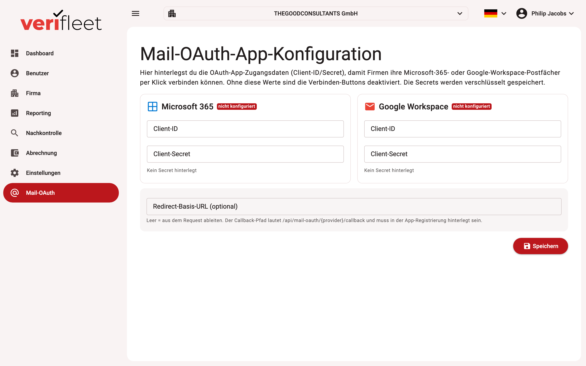

# Mail OAuth (Microsoft 365 / Google)

Under **Mail OAuth**, system administrators store the system-wide OAuth app configuration
for Microsoft 365 and Google Workspace. It is the technical foundation for the
"Connect with Microsoft" / "Connect with Google" flow that lets individual companies use
their own mailbox as the sender.

{ border-effect="line" thumbnail="true" width="100%" }

!!! note
    This area is only visible to users with the **system administrator** role. The
    company's own mail account, in contrast, is connected in the respective company under
    **Edit company**.

## Why company-owned senders?

By default the system sends check requests through the central mail service. Companies can
instead use their **own mailbox** (Microsoft 365 or Google Workspace) as the sender —
drivers then receive requests from a familiar address of their own organisation, which
noticeably improves delivery rates and acceptance.

## Configuration

Per provider (Microsoft / Google) you store the credentials of the OAuth app:

- **Client ID** of the application registered in Azure AD or Google Cloud
- **Client secret** — stored encrypted
- provider-specific extras where applicable (e.g. tenant)

Changes take effect **immediately, without a restart**.

## Flow for a company

1. The system administrator configures the OAuth app here once.
2. The company administrator opens **Edit company** and starts
   "Connect with Microsoft/Google" there.
3. After signing in with the provider, the system sends this company's mails through the
   connected mailbox.
