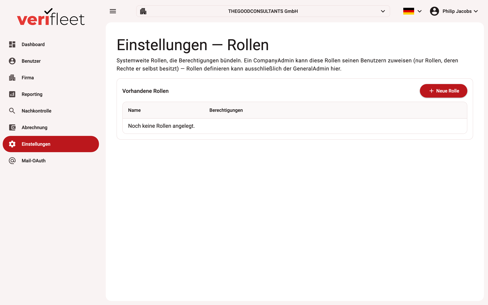

# Einstellungen — eigene Rollen

Unter **Einstellungen** definieren Systemadministratoren eigene Rollen mit frei
zusammengestellten Berechtigungen. Eigene Rollen ergänzen die fest eingebauten
Systemrollen (z. B. „Fahrer", „Fuhrparkleiter") um passgenaue Rechteprofile.

{ border-effect="line" thumbnail="true" width="100%" }

!!! note
    Dieser Bereich ist nur für Benutzer mit der Rolle **Systemadministrator** sichtbar.

## Eine Rolle anlegen

1. Klicken Sie auf **„Neue Rolle"**.
2. Vergeben Sie einen sprechenden Namen (z. B. „Nachkontrolle + Reporting").
3. Wählen Sie die gewünschten Berechtigungen aus der Liste aus.
4. Speichern Sie die Rolle.

## Eine Rolle zuweisen

Eigene Rollen werden in der **Benutzer-Detailansicht** zugewiesen — dort erscheinen sie
zusätzlich zu den Systemrollen in der Rollen-Auswahl. Ein Benutzer kann mehrere Rollen
gleichzeitig besitzen; die Berechtigungen addieren sich.

## Bearbeiten und Löschen

In der Rollen-Liste können Sie bestehende Rollen jederzeit **bearbeiten** (Stift-Symbol)
oder **löschen** (Papierkorb-Symbol). Änderungen an einer Rolle wirken sich unmittelbar
auf alle Benutzer aus, denen die Rolle zugewiesen ist.

!!! tip
    Vergeben Sie Berechtigungen so sparsam wie möglich. Erstellen Sie lieber mehrere
    kleine, klar umrissene Rollen als eine große Sammelrolle.
