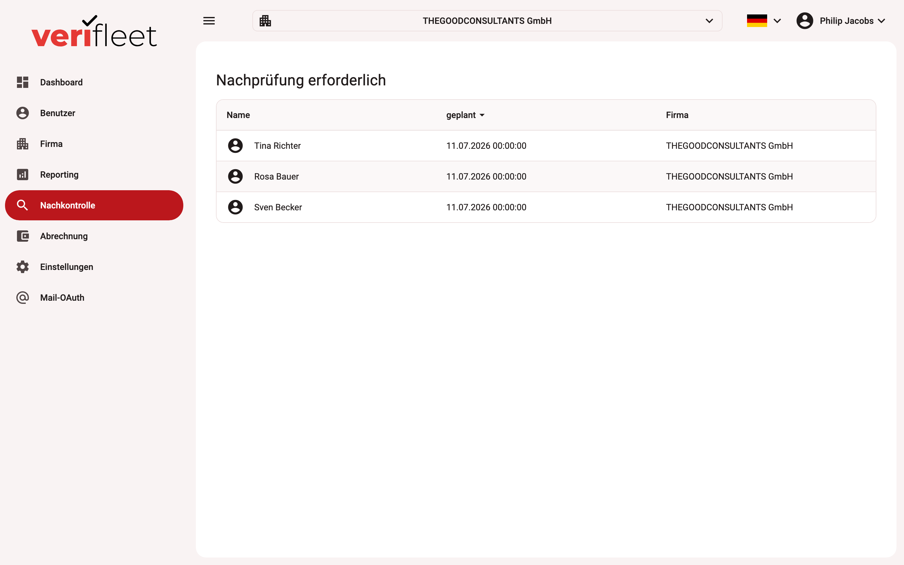

# Nachkontrolle 

In diesem Modul wird eine Übersicht aller Benutzer angezeigt, bei denen eine **Nachprüfung erforderlich** ist. Die Nachkontrollen betreffen in der Regel Führerscheinkontrollen (FSK) oder andere regelmäßige Prüfungen.

{ border-effect="line" thumbnail="true" width="100%" }

## Navigationspfad

1. **Linke Seitenleiste** > **Nachkontrolle**

## Tabellenübersicht

Die Tabelle enthält folgende Spalten:

| Spalte | Bedeutung |
|--------|-----------|
| **Name** | Name des Benutzers, bei dem eine Nachkontrolle ansteht. |
| **Geplant** | Geplanter Zeitpunkt der Nachkontrolle. |
| **Firma** | Zugehörige Firma des jeweiligen Benutzers. |

## Funktionen

- Die Liste ist **chronologisch sortierbar** nach dem geplanten Nachkontrolldatum.
- Mehrfache Einträge eines Benutzers (z. B. bei mehrfacher Planung) sind möglich.
- Jeder Benutzer ist mit einem Symbol (👤) dargestellt.

## Beispielhafte Einträge

| Name | Geplant | Firma |
|------|---------|-------|
| Fahrer | 05.05.2025 15:03:43 | Firma |
| Fahrer | 05.05.2025 14:00:08 | Firma |
| Fahrer2 | 25.04.2025 07:53:51 | Firma2 |
| Fahrer3 | 23.04.2025 18:01:18 | Firma3 |

## Hinweise

- Prüfen Sie regelmäßig diese Liste, um fällige Nachkontrollen rechtzeitig durchzuführen.
- Doppeltermine für einen Benutzer sollten geprüft und ggf. konsolidiert werden.
- Für die Durchführung der Nachkontrolle siehe den Bereich **Benutzer bearbeiten**.

