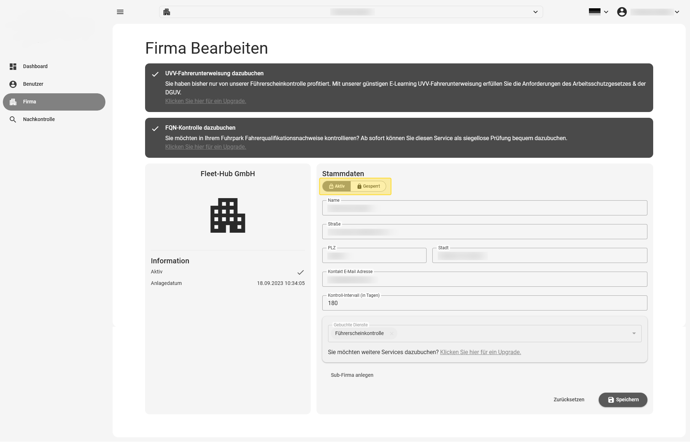
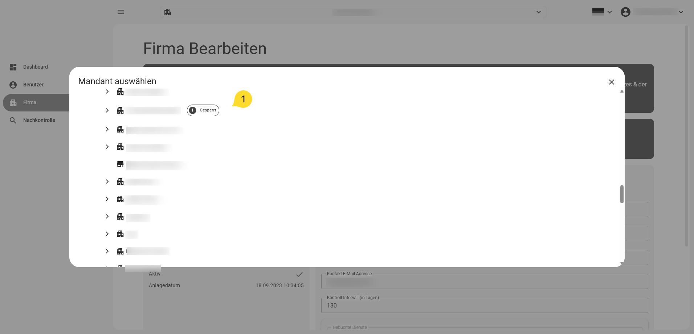

# Blocking / activating a company

You can block or activate a company to stop or resume the automatic sending of
driving-licence check requests.

Click the switch at the top left of the company edit view, then click Save to persist the
change.

{ border-effect="line" thumbnail="true" width="500" }

## Blocked companies in the search view

Blocked companies are marked with a "blocked" tag in the search view.

{ border-effect="line" thumbnail="true" width="500" }
