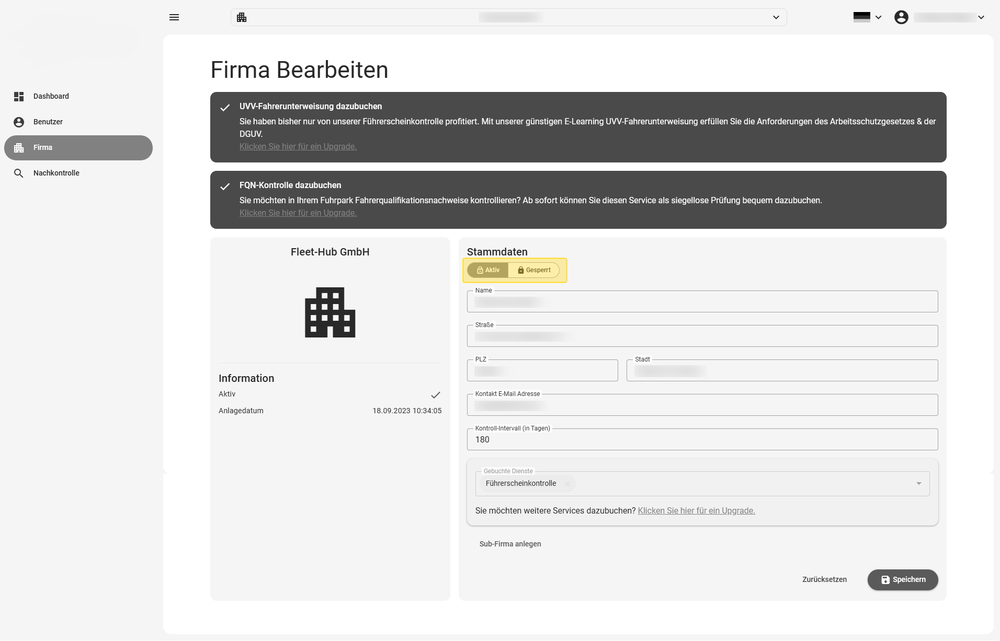
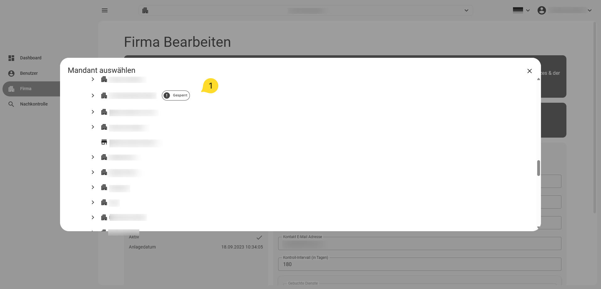

# Firma sperren / aktivieren

Sie können eine Firma sperren beziehungsweise aktivieren, um den automatischen Versand von Aufforderungen
zur Führerscheinkontrolle zu unterbinden beziehungsweise zu aktivieren.

Klicken Sie dazu auf den Schalter am oben links in der Ansicht, in der Sie die Firma bearbeiten

Klicken Sie nach der Änderung auf Speichern, um die Änderungen zu sichern.

{ border-effect="line" thumbnail="true" width="500" }

## gesperrte Firmen in der Suchansicht

Gesperrte Firmen werden in der Suchansicht durch einen Tag (gesperrt) gekennzeichnet.

{ border-effect="line" thumbnail="true" width="500" }