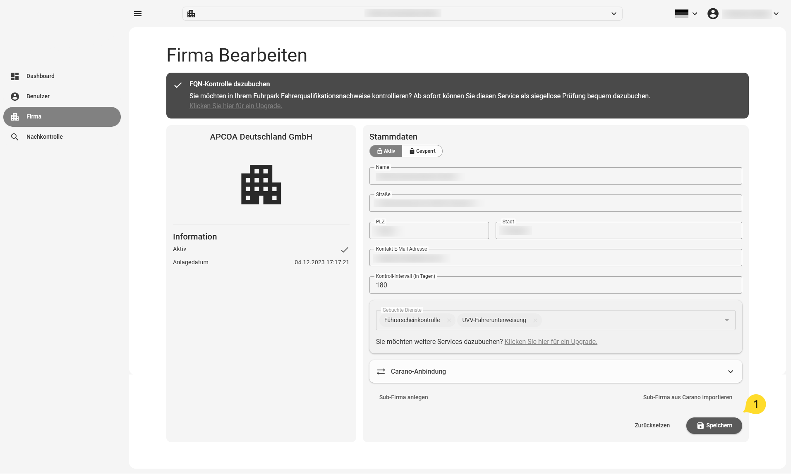
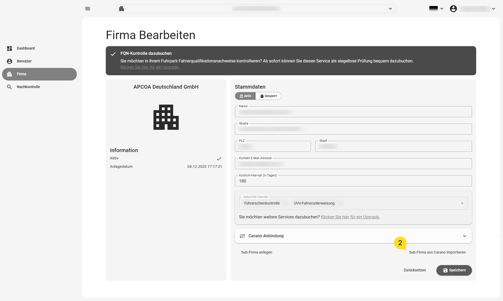
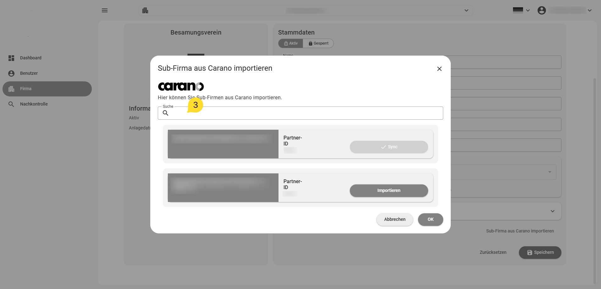
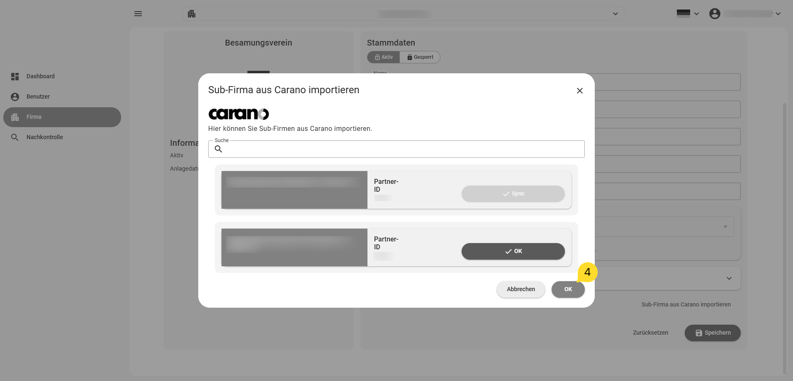
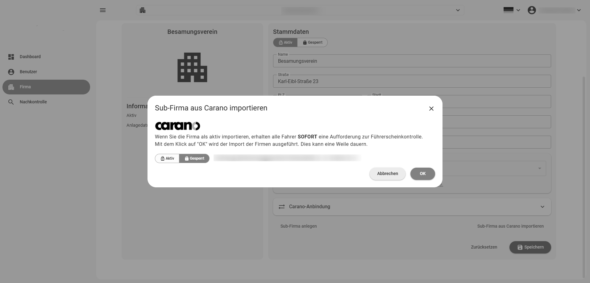
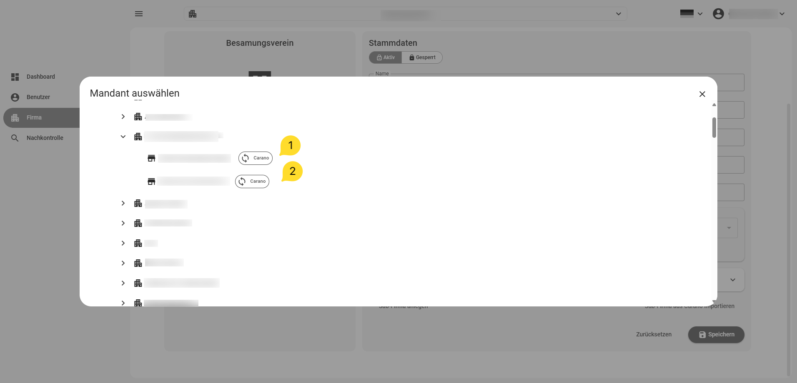

# Carano connection

Companies do not have to be created manually — they can alternatively be imported from the
Carano fleet-management system. For this, Carano has to provide them via the dedicated
REST API.

With the Carano link, your data (companies and users/drivers) is updated at least once a
day. You can import individual companies or all of them — you decide when calling the
import function described below.

!!! note
    Talk to your Carano support or your fleet-management provider (if they manage your
    companies via Carano) to obtain the required credentials. You need:

    1. your tenant identifier
    2. your username
    3. your password

!!! warning
    IMPORTANT:

    In the Carano system, companies are ALWAYS attached below a tenant. You therefore have
    to
    1. create the tenant in the system
    2. enter your credentials in the tenant  **(Credentials may only be entered at
    tenant level. Do not enter them in a company already imported from Carano — one level
    below!)**
    3. import the desired companies below the tenant

## Entering the Carano tenant credentials

### Creating / selecting the Carano tenant

After [creating a company](company-create.md) that you want to use as the Carano tenant
(this can also be the base company created for you), select it via the search function.

### Entering the credentials

1. Click "Company" in the menu.
2. Open the "Carano connection" section.
3. Enter the credentials in the dedicated fields.
4. Save with the "Save" button.

{ border-effect="line" thumbnail="true" width="500" }

!!! note
    The Carano fields are only visible with the required user permissions. Contact your
    administrator if you cannot see the Carano section.

## Importing companies

After entering the credentials in the Carano tenant company, a new entry
"Import sub-company from Carano" appears below the company data.

{ border-effect="line" thumbnail="true" width="500" }

### Opening the Carano import

Click the new entry to open the Carano import dialog.

{ border-effect="line" thumbnail="true" width="500" }

You can search for companies by typing into the search bar — useful when the list is long.

Proceed as follows:

#### 1. Select companies

Click the "Import" button behind each company to synchronise; its label changes to "OK".
Click again to undo. Finally click "OK" at the bottom right to confirm your selection.

{ border-effect="line" thumbnail="true" width="500" }

!!! note
    Companies already synchronised are marked with "Sync" on the button behind the
    company name.

#### 2. Blocked import

In the following dialog, choose whether to import the company as active or blocked.

!!! warning
    If you import a company as active, all users/drivers may immediately receive a
    driving-licence check request. It is strongly recommended to always import companies
    as "blocked" first and set them to "active" after verifying the imported data.

{ border-effect="line" thumbnail="true" width="500" }

#### 3. Import successful?

A successful import is confirmed by a system message. If the import fails, verify your
credentials or contact support. Confirm the dialog with "OK".

### Import marker in the search list

After importing a company for synchronisation, it carries a marker in the company search —
so you can identify Carano-synchronised companies right at selection time.

{ border-effect="line" thumbnail="true" width="500" }
