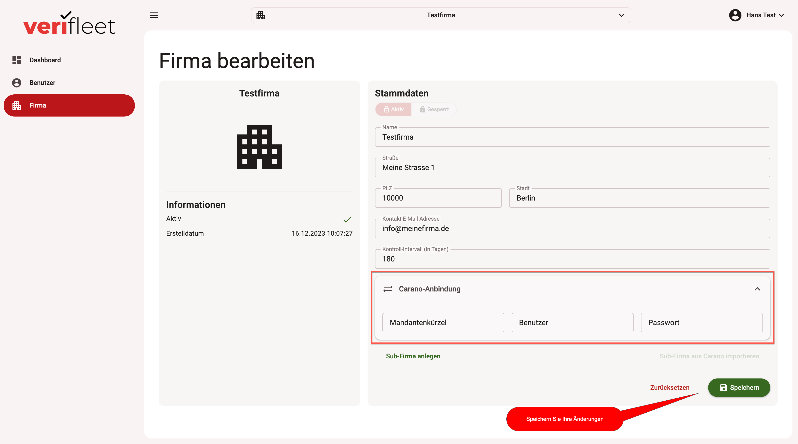
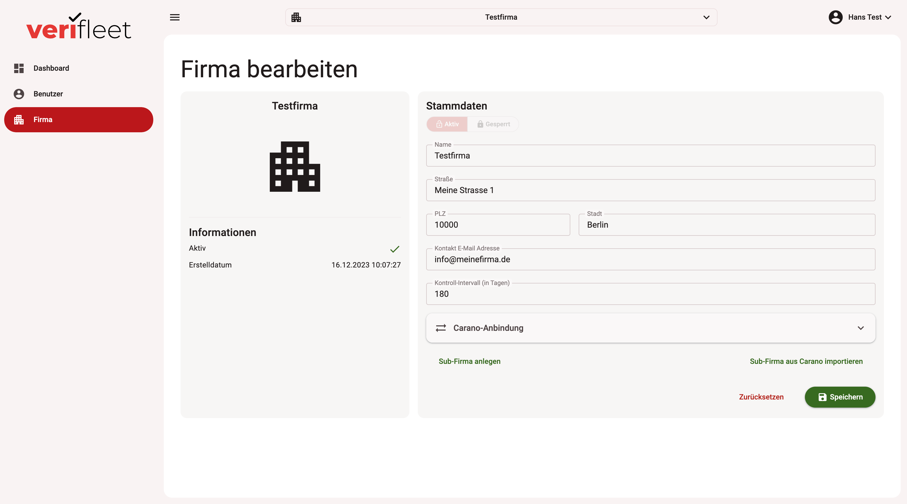
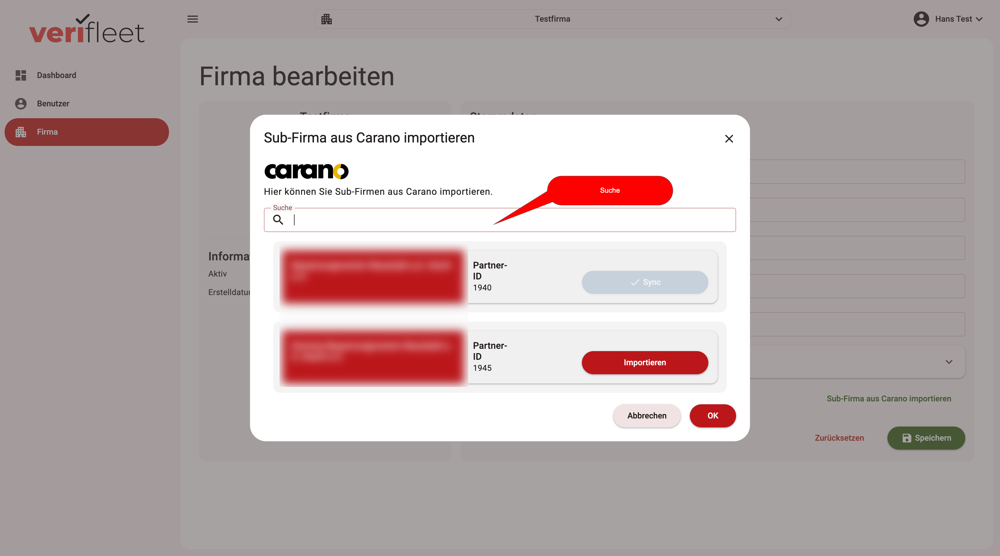
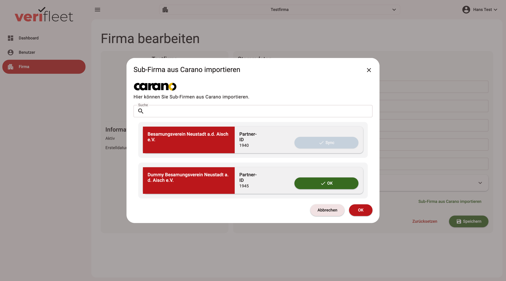
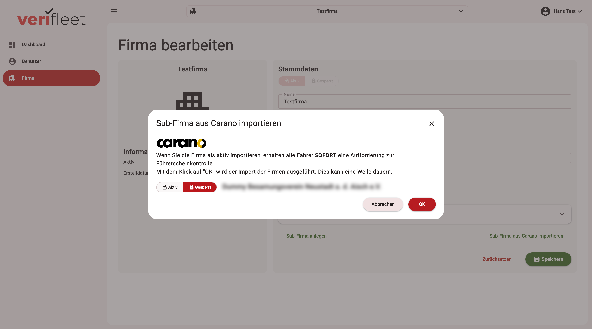
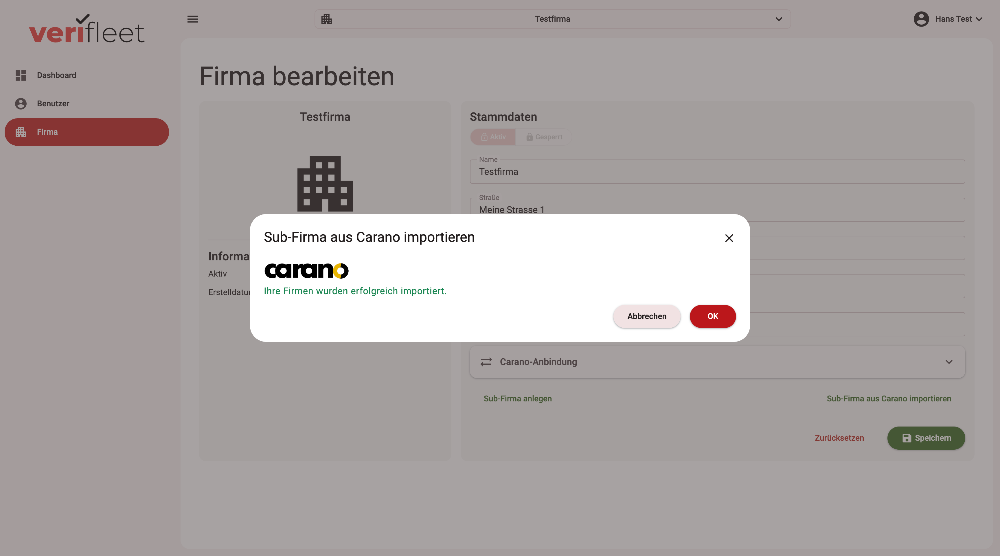
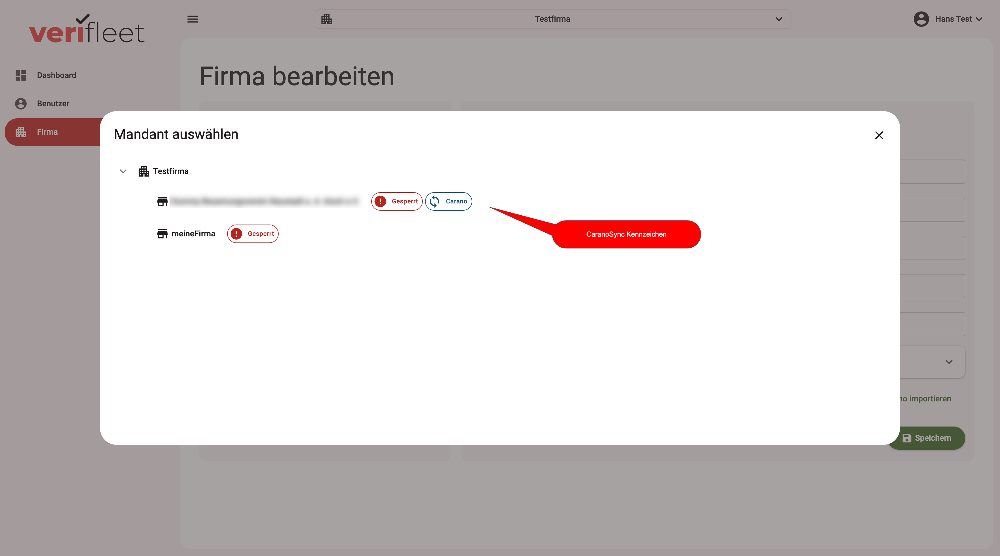

# Carano Anbindung

<show-structure for="chapter,procedure" depth="3"/>

Firmen können nicht nur manuell angelegt werden. Sie können alternativ aus dem Fuhrpark-Management-System Carano
importiert werden. Um Firmen aus Carano importieren zu können, müssen diese seitens Carano auf der dafür vorgesehenen
Rest-API zur Verfügung gestellt werden.

Mit Hilfe der Carano-Verknüpfung werden Ihre Daten (Firmen und Benutzer/Fahrer) mindestens einmal täglich aktualisiert.
Sie können dabei entweder einzelne Firmen importieren oder alle Ihre Firmen importieren. Dies entscheiden Sie beim
Aufruf der Importfunktion, die weiter unten beschrieben wird.

!!! note
    Sprechen Sie mit Ihrem Carano-Support oder mit Ihrem Flotten-Management-Dienstleister (wenn dieser Ihre Firma/Firmen)
    über Carano managed, um die notwendigen Zugangsdaten zu erhalten. Sie benötigen:

    1. Ihr Mandanten-Kürzel
    2. Ihren Benutzernamen
    3. Ihr Passwort

!!! warning
    WICHTIGER HINWEIS:

    Bitte beachten Sie, das im Carano-System Firmen IMMER unterhalb eines Mandanten aufgehängt sind. Aus diesem Grund
    müssen Sie
    1. den Mandanten im System anlegen
    2. Im Mandaten Ihre Zugangsdaten eintragen  **(Die Zugangsdaten dürfen nur auf Ebene des Mandanten eingetragen
    werden. Tragen Sie die Zugangsdaten nicht in einer bereits aus Carano importierten Firma - also eine Ebene tiefer - ein!)**
    3. Unterhalb des Mandanten die gewünschten Firmen importieren

## Zugangsdaten des Carano-Mandanten eintragen

### Carano-Mandanten anlegen / auswählen

Nachdem Sie - wie oben beschrieben - eine [Firma angelegt](company-create.md) haben, die Sie als Carano-Mandant verwenden wollen (dies
kann auch die Basisfirma sein, die für Sie im System angelegt ist), wählen Sie diese Firma über die Suchfunktion
aus.

### Zugangsdaten eintragen

1. Klicken Sie im Menü auf "Firma".
2. Öffnen Sie den Bereich "Carano-Anbindung".
3. Tragen Sie die Zugangsdaten in den dafür vorgesehenen Bereich ein.
4. Speichern Sie die Änderungen durch Klick auf den Button "Speichern".

{ border-effect="line" thumbnail="true" width="500" }

!!! note
    Sie sehen die Eingabefelder für die Carano-Anbindung nur, wenn Sie die notwendigen Benutzer-Berechtigungen
    besichtzen. Wenden Sie sich ggfls. an Ihren Admnistrator, falls sie den Bereich für die Carano-Anbindung
    nicht sehen.

## Firmen importieren

Nachdem Sie Ihre Zugangsdaten in die Carano-Mandanten-Firma eingetragen haben, steht Ihnen unterhalb der
Firmendaten ein neuer Menüpunkt "Sub-Firma aus Carano importieren" zur Verfügung.

{ border-effect="line" thumbnail="true" width="500" }

### Carano-Import aufrufen

Klicken Sie auf den neuen Menüpunkt, um den Carano-Import Dialog zu öffnen.

{ border-effect="line" thumbnail="true" width="500" }

Sie können im Carano-Import Dialog durch Eingabe eines Suchbegriffs in der Suchzeile nach Firmen suchen. Dies
ermöglicht ein einfacheres Auffinden der zu synchronisierenden Firmen, wenn viele Firmen in der Liste aufgeführt sind.

Gehen Sie nun wie folgt vor:

#### 1. Firmen auswählen
Klicken Sie bei den zu synchronisierenden Firmen auf den Button "Importieren" hinter dem Firmennamen. Die Aufschrift
des Buttons ändert sich in "OK". Sie können Ihre Auswahl durch nochmaliges Klicken rückgängig machen. Klicken Sie
abschließend rechts unten auf "OK", um Ihre Auswahl zu bestätigen.

{ border-effect="line" thumbnail="true" width="500" }

!!! note
    Firmen die bereits synchronisiert werden, sind durch die Aufschrift "Sync" auf dem Button hinter dem
    Firmennamen gekennzeichnet.

#### 2. gesperrter Import

Wählen Sie im folgenden Dialog, ob Sie die Firma aktiv oder gesperrt importieren wollen.

!!! warning
    Wenn Sie eine Firma aktiv importieren erhalten alle Benutzer / Fahrer ggfls. sofort eine Aufforderung zur Prüfung des
    Führerscheins. Es wird ausdrücklich empfohlen Firmen immer zunächst "gesperrt" zu importieren und nach Prüfung
    der Import-Daten auf "aktiv" zu setzen.

{ border-effect="line" thumbnail="true" width="500" }

#### 4. Import erfolgreich?

Ein erfolgreicher Import wird durch eine entsprechnde Meldung des Systems bestätigt. Sollte der import nicht
erfolgreich sein, prüfen Sie Ihre Zugriffsdaten oder wenden Sie sich an Ihren Support. Bestätigen Sie den Dialog
mit "OK".

{ border-effect="line" thumbnail="true" width="500" }

### Import-Kennzeichen in der Suchliste

Nachdem Sie eine Firma zur Synchronisation mit Carano importiert haben, hat die Firma in der Firmen-Suche ein
entsprechendes Kennzeichen. So erkennen Sie Firmen, die mit Carano synchronisisert werden bereits bei der
Firmen-Auswahl bzw. bei der Firmen-Suche.

{ border-effect="line" thumbnail="true" width="500" }