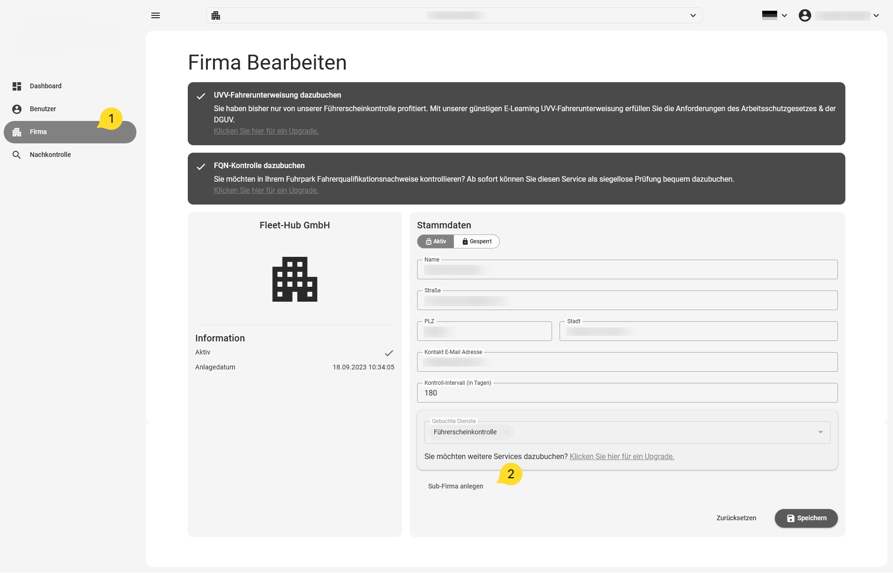
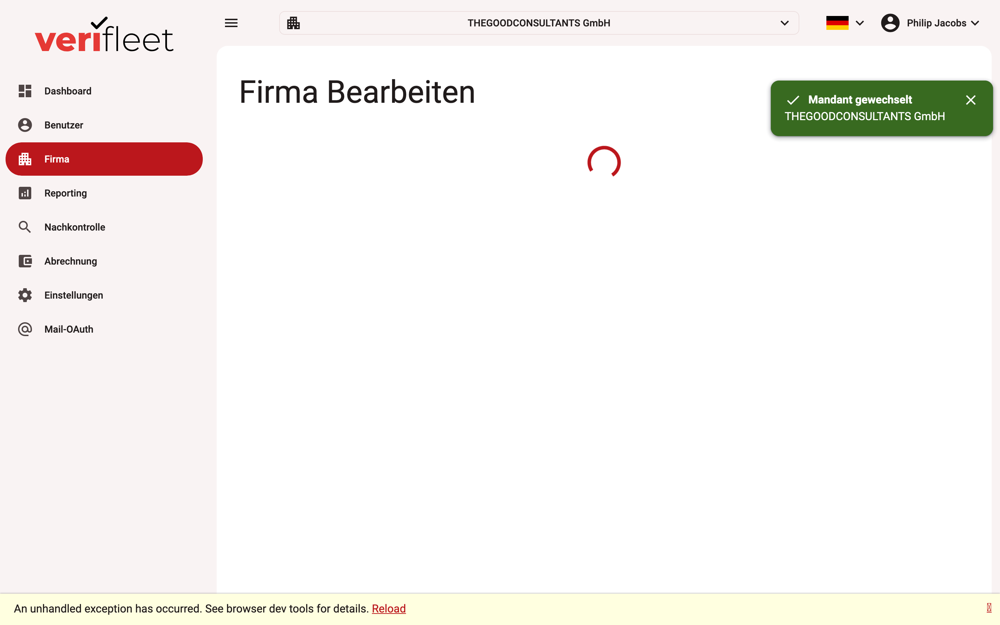

# Creating a company

To create a company, first select the company below which you want to create the new one.
A new company can only ever be created hierarchically below an existing company.

1. Click "Company" in the menu on the left to display the company master data.
2. Then click "Create sub-company" at the bottom of the view.

{ border-effect="line" thumbnail="true" width="500" }

The view for entering a new company opens. Fill in all fields as completely as possible.
We recommend leaving the check interval at the default of 180 days. After entering all
data, save the new company with the "Save" button at the bottom right.

{ border-effect="line" thumbnail="true" width="100%" }

!!! note
    The new company is created below the most recently selected company. By selecting the
    appropriate parent first, you can model your company structure hierarchically. Please
    note that companies cannot be moved afterwards.
