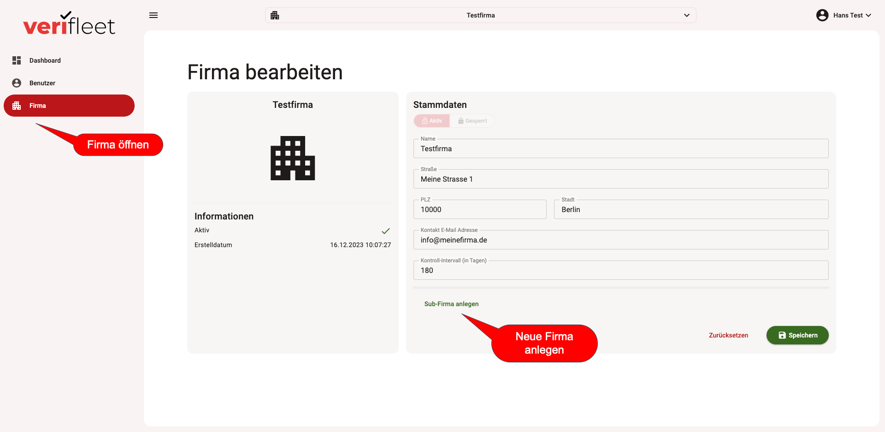
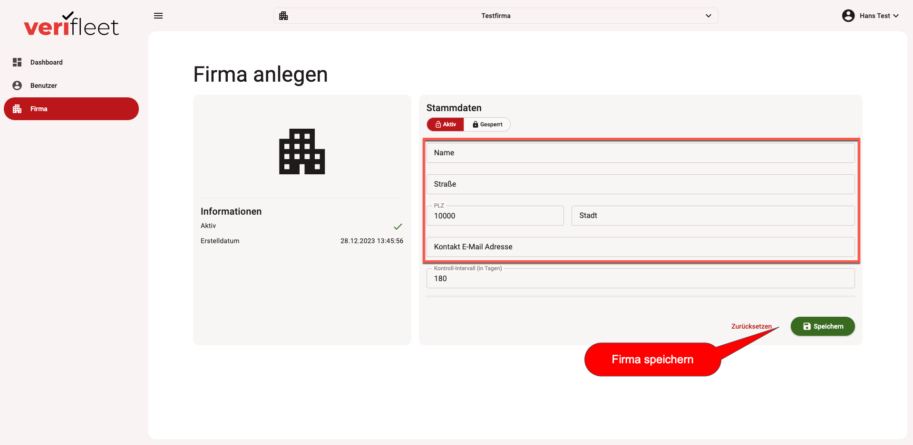

# Firma anlegen

Um eine Firma anzulegen, wählen Sie zunächst die Firma aus, unterhalb derer sie die neue Firma anlegen wollen.
Eine neue Firma kann immer nur hierarchisch unterhalb einer bereits vorhandenen Firma angelegt werden.

1. Klicken Sie dazu links im Menü auf den Button "Firma", um die Firmenstammdaten anzuzeigen.
2. Klicken Sie danach unten in der Ansicht auf "Sub-Firma anlegen".

{ border-effect="line" thumbnail="true" width="500" }

Danach öffnet sich die Ansicht, um eine neue Firma zu erfassen. Führen Sie hier alle Felder möglichst vollständig aus.
Es empfiehlt sich, das Prüfinterval im Standard bei 180 Tagen zu belassen.
Nachdem sie alle Daten eingegeben haben, speichern Sie die neue Firma mit dem "Speichern"-Button unten rechts.

{ border-effect="line" thumbnail="true" width="500" }

!!! note
    Die neu angelegte Firma wird unterhalb der zuletzt ausgewählten Firma angelegt. In dem sie vorher die passende
    Firma auswählen, können Sie Ihre Firmenstruktur hierarchisch im System anlegen. Bitte achten Sie darauf, dass ein nachträgliches
    Verschieben von Firmen nicht möglich ist.