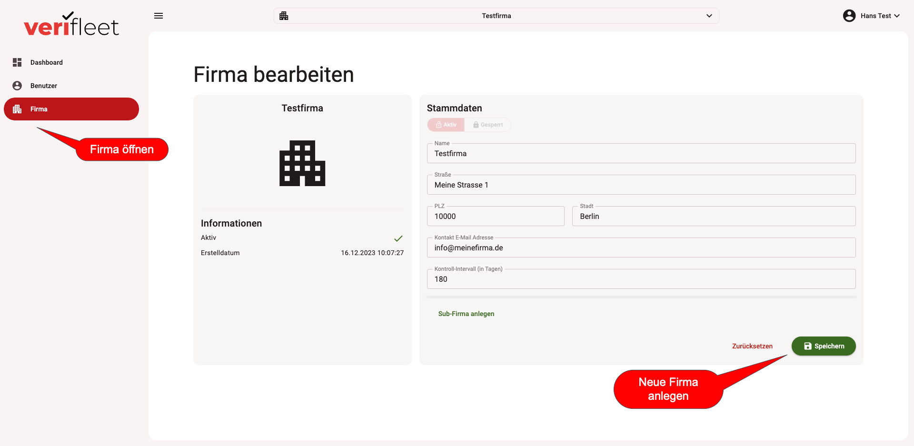

# Firma bearbeiten

Um eine Firma anzulegen, wählen Sie zunächst die Firma aus, unterhalb derer sie die neue Firma anlegen wollen.
Eine neue Firma kann immer nur hierarchisch unterhalb einer bereits vorhandenen Firma angelegt werden.

Klicken Sie dazu links im Menü auf den Button "Firma", um die Firmenstammdaten anzuzeigen.

{ border-effect="line" thumbnail="true" width="500" }

Nachdem sie alle Daten eingegeben haben, speichern Sie die neue Firma mit dem "Speichern"-Button unten rechts.