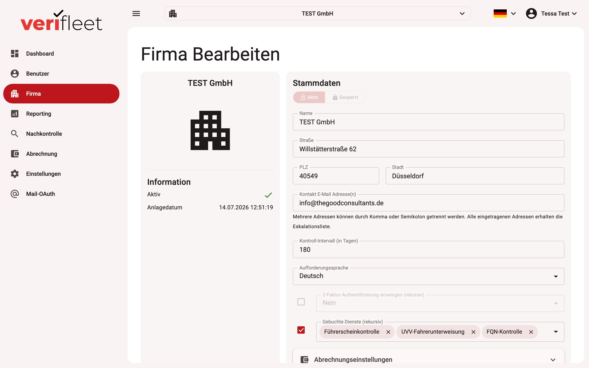

# Firma bearbeiten

In diesem Bereich verwalten Sie zentrale Informationen zur aktuell ausgewählten Firma. Hier können Sie Stammdaten ändern, zusätzliche Einstellungen konfigurieren und Sub-Firmen verwalten.

{ border-effect="line" thumbnail="true" width="100%" }

## Übersicht

Die Firmenbearbeitungsmaske ist in zwei Hauptbereiche unterteilt:

- **Linker Bereich**: Anzeige grundlegender Informationen (Name, Status, Anlagedatum)
- **Rechter Bereich**: Bearbeitungsfelder und erweiterte Konfigurationen

## Stammdaten bearbeiten

Im rechten Formularbereich können Sie die Stammdaten der Firma anpassen:

- **Name**: Offizieller Firmenname
- **Straße, PLZ, Stadt**: Anschrift des Unternehmens
- **Kontakt E-Mail Adresse**: Hauptkontaktadresse der Firma
- **Kontroll-Intervall (in Tagen)**: Zyklus für interne Prüfungen (z. B. Führerscheinkontrolle)
- **Gebuchte Dienste**: Auswahl der aktuell aktiven Module/Dienste (z. B. Führerscheinkontrolle)

Der Status der Firma (Aktiv / Gesperrt) lässt sich oben per Schaltfläche umschalten.

## Erweiterte Einstellungen

Unterhalb der Stammdaten finden Sie aufklappbare Abschnitte für zusätzliche Konfigurationen:

- **Abrechnungseinstellungen**: Abrechnungsart (keine / individuell / vererbt) — siehe [Abrechnung](../Admin/invoices.md)
- **Corporate Identity (Logo & Farben)**: eigenes Branding oder von der übergeordneten Firma erben — siehe [Design & Branding](company-theming.md)
- **Backendanpassungen**: Experten-CSS für die Oberfläche — siehe [Design & Branding](company-theming.md)
- **Mailing/-Clientanpassungen**: Mail-Template-Anpassung oder Vererbung — siehe [Design & Branding](company-theming.md)
- **Fahrerdaten & Schnittstelle** (früher „Carano-Anbindung“): Datenquelle der Fahrer (*Vererbt* / *Manuell* / *Carano* / *REST-API*), Carano-Zugangsdaten und API-Schlüssel für die Schnittstelle — siehe [Fahrerdaten & Schnittstelle](company-driver-data.md) und [Carano-Anbindung](company-carano-connection.md). Nur für Plattform-Administratoren sichtbar
- **Mail-Konto**: eigenes Firmen-Postfach (Microsoft 365 / Google) als Mail-Absender verbinden
- **Nachkontrolle: Score-Schwellen**: Schwellwerte, ab denen Kontrollen automatisch genehmigt bzw. zur Nachkontrolle gegeben werden
- **Erinnerungen & Führerschein-Ablauf**: Erinnerungs-Intervalle, Vorwarnzeit vor Ablauf des Führerscheins und der **Standard-Kontaktkanal** (*Erben* / *E-Mail* / *SMS*), über den die Fahrer dieser Firma zur Kontrolle aufgefordert werden. *Erben* übernimmt den Wert der übergeordneten Firma; einzelne Fahrer können den Kanal in ihrem Profil überschreiben (siehe [Benutzer bearbeiten](../Users/user-edit.md))
- **Datenaufbewahrung**: Aufbewahrungsfristen für Daten dieser Firma
- **Mail-Vorlagen**: Texte der versendeten E-Mails je Firma anpassen

!!! note
    Die aufklappbaren Abschnitte erscheinen nur bei **Unterfirmen** (Firmen mit übergeordneter
    Firma) und nur, wenn Ihr Benutzer die jeweilige Berechtigung besitzt.

## Sub-Firma verwalten

Am unteren Rand der Seite stehen Ihnen folgende Optionen zur Verfügung:

- **Sub-Firma anlegen**: Manuelles Anlegen einer untergeordneten Firma
- **Sub-Firma aus Carano importieren**: Übernahme von Sub-Firmen aus dem Carano-System (nur bei Datenquelle „Carano“ mit hinterlegten Zugangsdaten)

## Weitere Aktionen

- **Firma löschen**: Entfernt die Firma dauerhaft aus dem System
- **Zurücksetzen**: Setzt alle nicht gespeicherten Änderungen zurück
- **Speichern**: Übernimmt alle vorgenommenen Änderungen

## Hinweise

- Änderungen werden erst nach Klick auf **„Speichern“** übernommen. Ausnahme: Das Umstellen der **Datenquelle der Fahrer** wirkt sofort nach Bestätigung des Dialogs „Datenquelle umstellen?“.
- Einige Abschnitte (z. B. Fahrerdaten & Schnittstelle) sind nur sichtbar, wenn entsprechende Berechtigungen oder Konfigurationen vorliegen.
- Gesperrte Firmen können nicht bearbeitet oder im System verwendet werden.