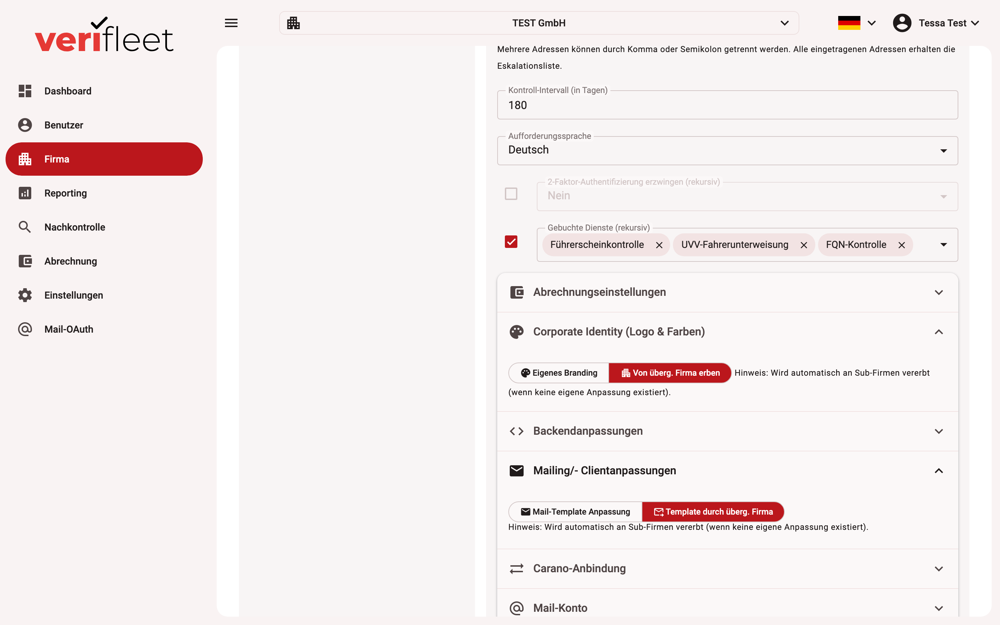

# Design & branding (tenant CI)

Every company can adapt the look of the system and of the e-mails it sends to its own
corporate identity. All settings live under **Edit company** in the sections
**Corporate identity (logo & colors)**, **Backend customizations**,
**Mailing/client customizations** and **Mail templates**.

{ border-effect="line" thumbnail="true" width="100%" }

## Inheritance across the company hierarchy

Branding settings are **inherited top-down**: if a company has no configuration of its
own, the configuration of its parent company applies automatically — up to the top level,
where the system default takes over. It is therefore enough to maintain the branding once
at tenant level; all sub-companies pick it up automatically.

## Corporate identity (logo & colors)

Per company you choose between **"own branding"** and **"inherit from parent company"**.
With own branding you maintain the colour scheme (colour pickers, no CSS knowledge
required) and logos — separately for light and dark mode.

## Backend customizations (expert CSS)

Additional CSS rules for fine-tuning the interface. Loaded after the theme and overrides
it selectively.

## Mailing/client customizations (e-mails & links)

These settings determine how check requests and notifications appear:

| Setting | Effect |
|---|---|
| **Product name** | Name of the software in mails and UI |
| **Support e-mail** | Contact address in the profile menu and in mails |
| **URLs** | Links to driver software, admin software, documentation, imprint, privacy policy |
| **Primary/secondary colour** | Colours of the e-mail templates |
| **Logo** | Logo in the e-mail templates |
| **Sender address** | Sender of this company's system mails |
| **E-mail adaptation** | Selection of a customer-specific mail template variant |

## Customising mail templates

In addition to branding, the **texts of the mail templates** can be adapted per company
(section **Mail templates**; toggle "mail template customisation" / "template from parent company"). Templates that are not customised inherit — like
the rest of the branding — from the parent company.

!!! tip
    After branding changes, verify the result with a test check request to one of your own
    test drivers before the next automatic request wave runs.
