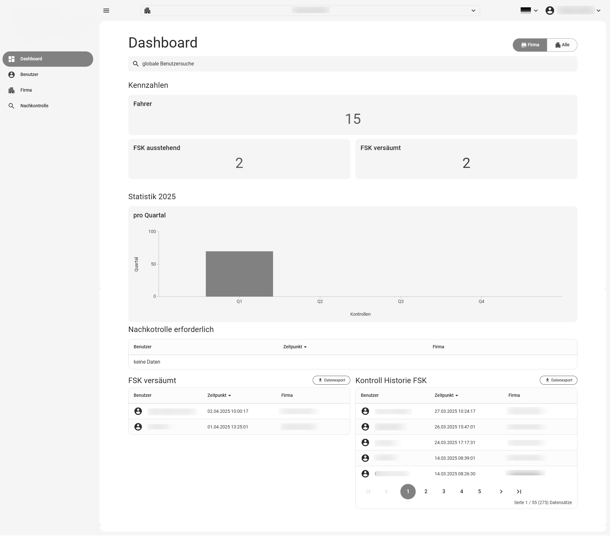
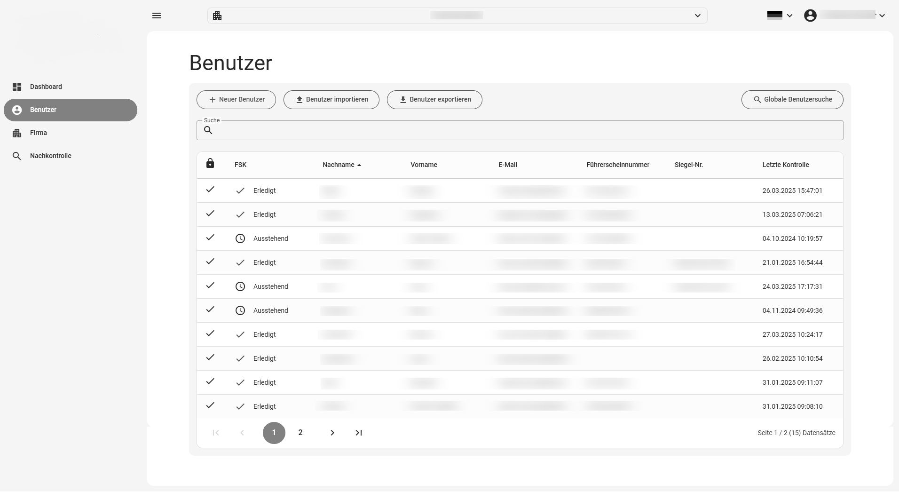
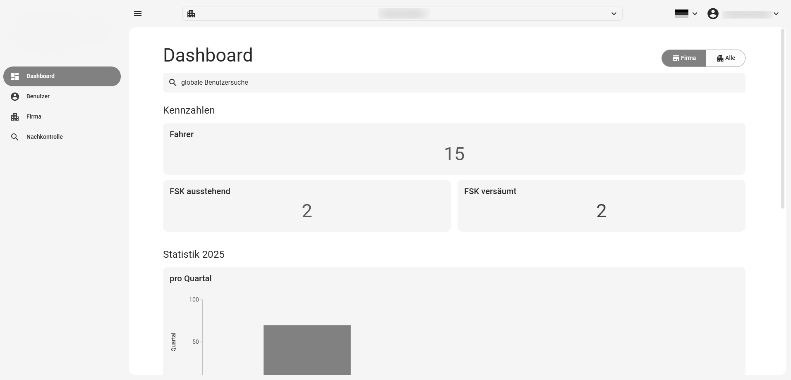
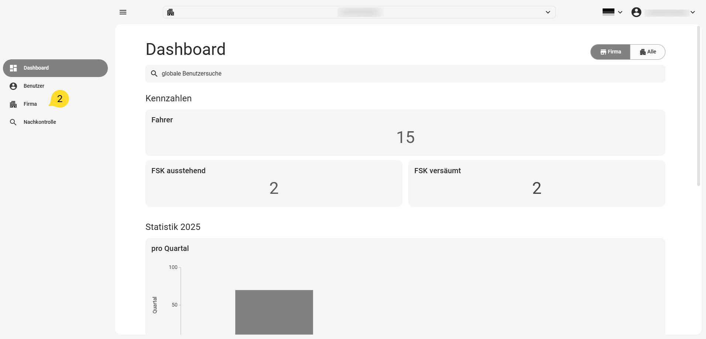
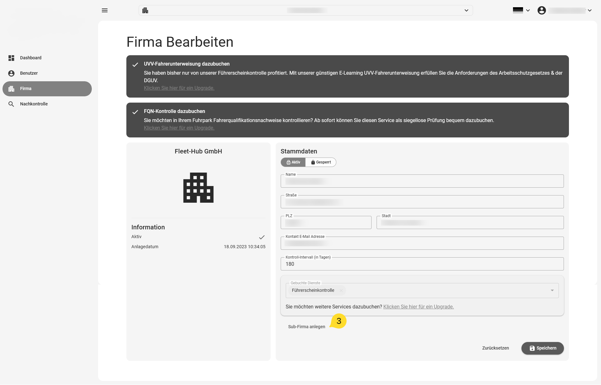
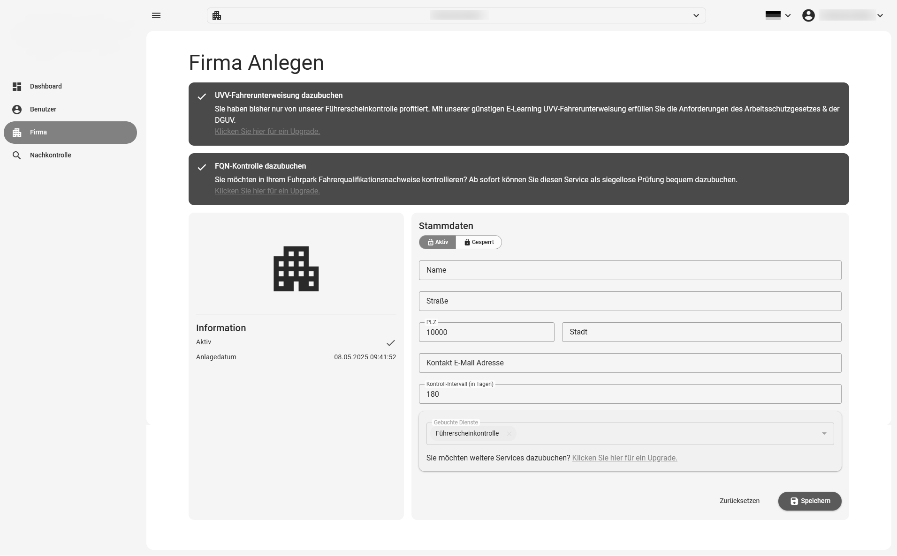
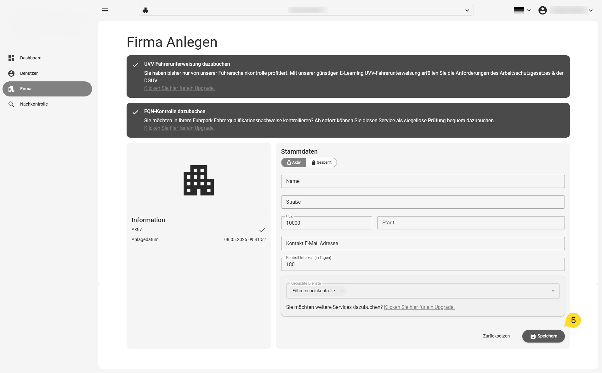
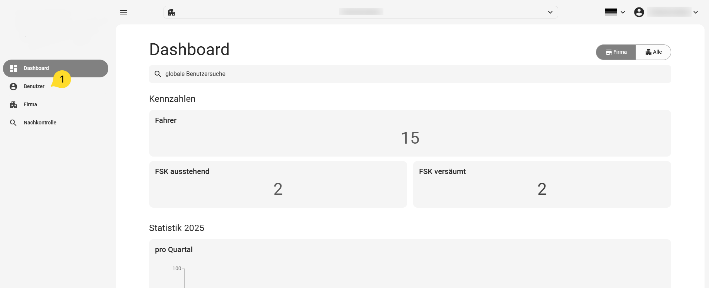
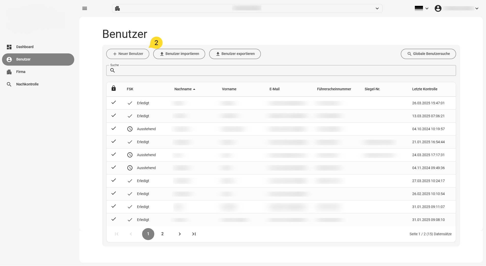
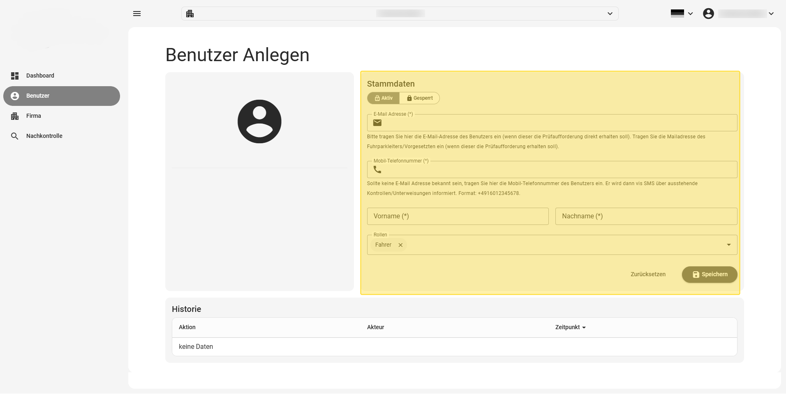

# First steps

Please note: if you registered via self-registration, your company already exists and you
are working in the context of that company after signing in.

Context means that everything shown on the dashboard refers to the company displayed at
the top centre of the application.

## Screen layout

### Dashboard

The dashboard has several areas containing the most important information about the state
of the system and the checks. The areas are marked in the image below and explained in the
following sections.

{ border-effect="line" thumbnail="true" width="500"}

### 1. Company search / selection

Click the company search/selection to choose a company. A dialog opens showing all your
companies as a hierarchy. Click an entry to select the company. The selected company is
then displayed in the search bar at the top of the screen. All details on the dashboard
and all views reachable via the menu now refer to the selected company.

### 2. Menu

The menu is on the left-hand side of the screen. It provides access to all available
views. Its scope may differ depending on the permissions of the signed-in user.

### 3. Global user search

The global user search finds a user in any of your companies, regardless of which company
is currently selected. Click "global user search" and enter the search criteria in the
dialog — part of a name, e-mail address or licence number is enough. Click a user in the
result list to open their detail view.

### 4. Data switch

The data switch toggles the dashboard between viewing a single company (the currently
selected one) and the cumulative view of all your companies — drivers, checks in the
current month, pending and missed checks.

### 5. KPIs

The KPIs at the top of the application give you a quick overview of the state of the
licence checks and possible problems.

!!! note
    Clicking "drivers" and "missed checks" jumps directly to the user list or the list of
    missed checks. PREREQUISITE: you are in "company" mode, *not* in "all" mode.

### 6. Check overview

The statistics chart shows how many checks were performed by your users in each quarter of
the year.

### 7. List of missed checks

This list shows all users who have not yet performed their scheduled check. These drivers
are reminded again after 7 days, and you as fleet manager receive a parallel notification
by e-mail. Click a user to open their details.

### 8. Follow-up check

The follow-up check shows which drivers did not complete their check successfully. For
these users a manual follow-up check is required, in which a human decides whether the
check counts as successful or the user has to be contacted.

!!! warning
    Users who are "not checkable" or "not reachable" do not receive any requests from the
    system! A user needs at least an e-mail address or a mobile number in their data to
    receive a request. In addition, a user needs at least one check attribute (licence
    number or seal number) to receive a check request.

### 9. List of performed checks

This list gives an overview of which users most recently performed a driving-licence
check.

## List views

List views give you a quick overview of many records. Sort a list by clicking a column
header. To search within a list, type into the search field above it.

To create a new record, click the "+ New user" (etc.) button at the top left above the
list.

{ border-effect="line" thumbnail="true" width="500"}

If the data area offers import/export, the corresponding buttons are above the list, as is
the global search button (where available) for finding e.g. drivers outside the currently
selected company.

## Detail views

The detail view of a record lets you maintain all data in that area.

!!! note
    **IMPORTANT:**

    After making your changes, always click the "Save" button at the bottom right of the
    detail view — otherwise the entered data is lost.

Besides data entry, the detail area also offers actions affecting only this user (e.g.
manually requesting a licence check), assigning permissions, or — for companies —
configuring the connection to a leading system (e.g. Carano).

!!! tip
    Give users only the permissions they really need. Inexperienced users might otherwise
    be able to damage your system.

## Creating a company

### 1. Sign in

Sign in so that you can see the dashboard.

{ border-effect="line" thumbnail="true" width="500"}

### 2. Open the current company

Click "Company" in the menu on the left to display the master data of the current company.

{ border-effect="line" thumbnail="true" width="500"}

### 3. Create a new (sub-)company

In the view showing the current company's data, click "Create sub-company" at the bottom.
This creates a new company below the current one.

{ border-effect="line" thumbnail="true" width="500"}

### 4. Enter the new company's data

Enter the data for the new company as completely as possible (name, street, postcode,
city, e-mail).

!!! warning
    **IMPORTANT:**

    Leave any additional fields — shown depending on your permissions — empty. They are
    covered in detail later.

!!! note
    **NOTE:**

    If you leave mandatory fields empty, the system points this out with a message.

{ border-effect="line" thumbnail="true" width="500"}

### 5. Save the new company

Click the "Save" button at the bottom right to save the new company.

{ border-effect="line" thumbnail="true" width="500"}

!!! tip
    Further information on managing companies: [Company management](../Companies/company-management.md).

## Creating a driver

### 1. Open the user list

After signing in, click "Users" in the menu on the left.

{ border-effect="line" thumbnail="true" width="500"}

### 2. Create a new user

The user list is displayed (empty if no users exist yet). Click the "New user" button
above the list.

{ border-effect="line" thumbnail="true" width="500"}

### 3. Enter the new user's data

Enter all required data (first name, last name, e-mail or mobile number).

!!! warning
    **WARNING:**

    If you create an "active" driver (see the toggle at the top of the driver view), they
    receive a check request immediately after saving.

    If you do not want this, set the driver to "blocked" first!

!!! note
    **NOTE:**

    If you leave mandatory fields empty, the system points this out with a message.

{ border-effect="line" thumbnail="true" width="500"}

### 4. Save the new user

Click "Save" at the bottom right. After saving, the user appears in the user list.
