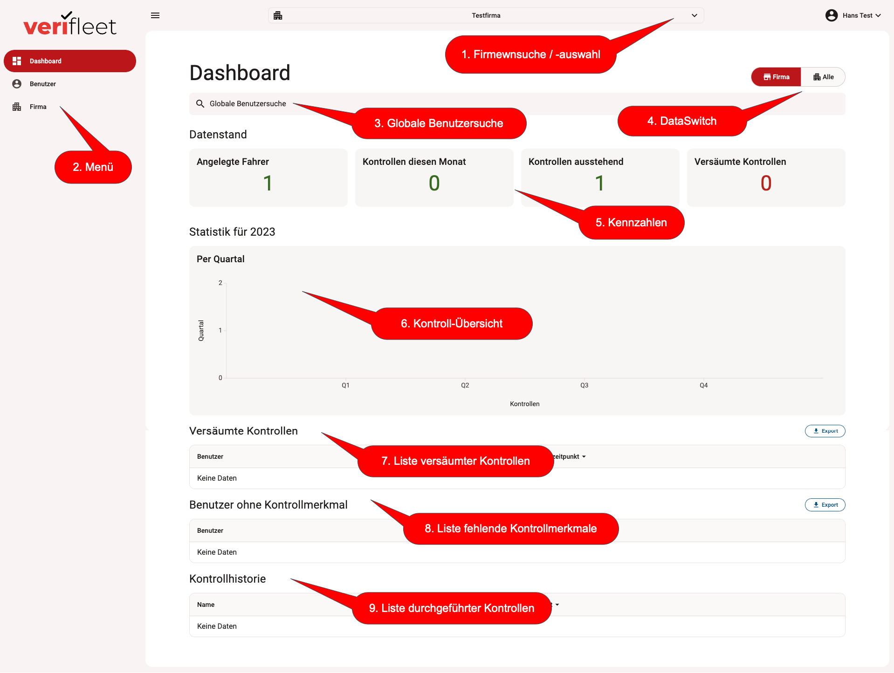
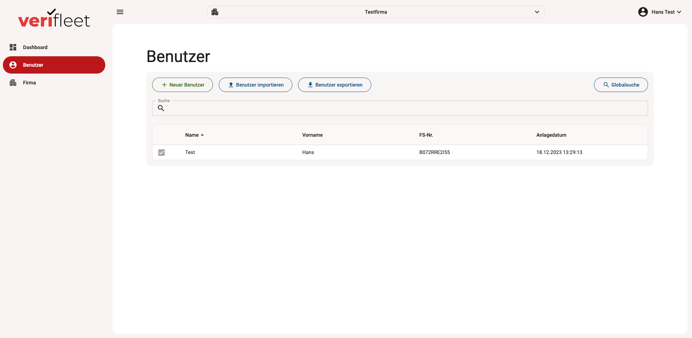
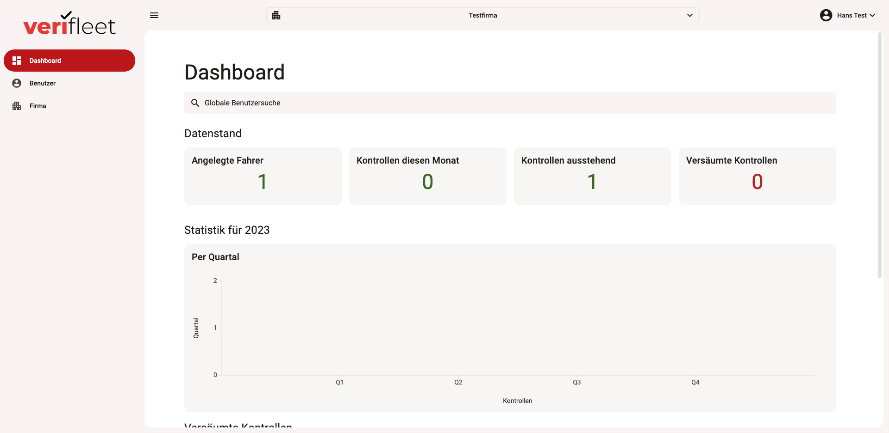
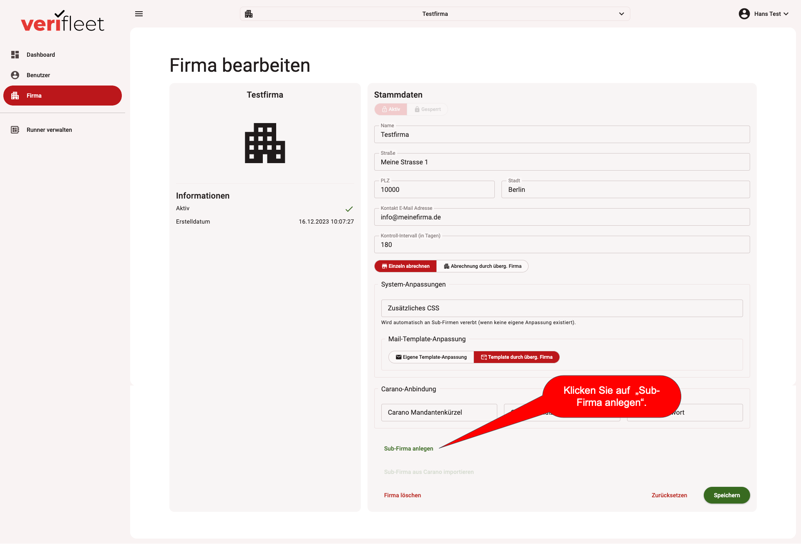
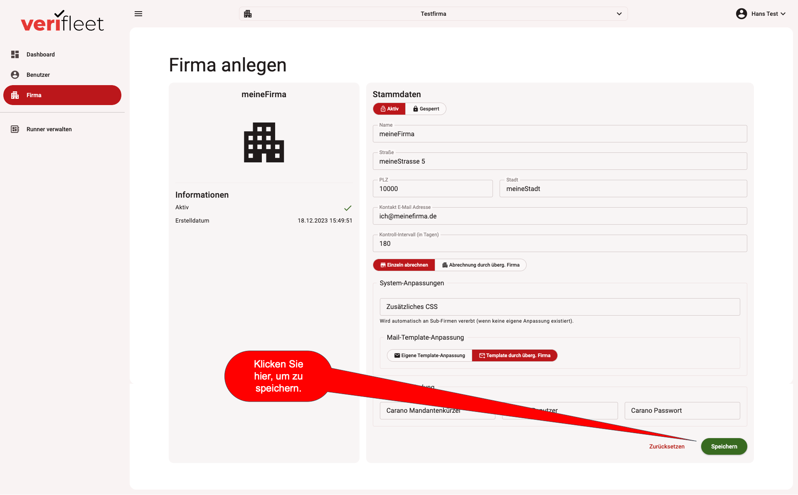
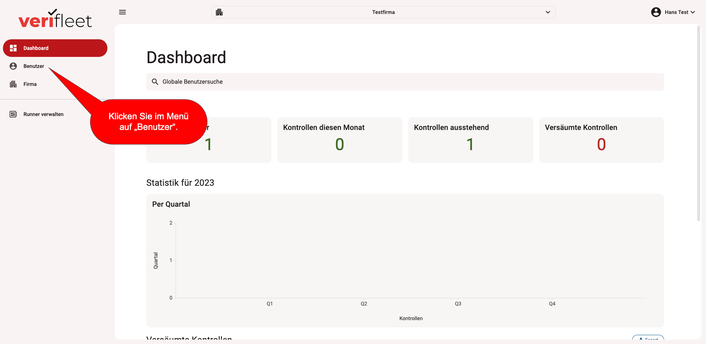
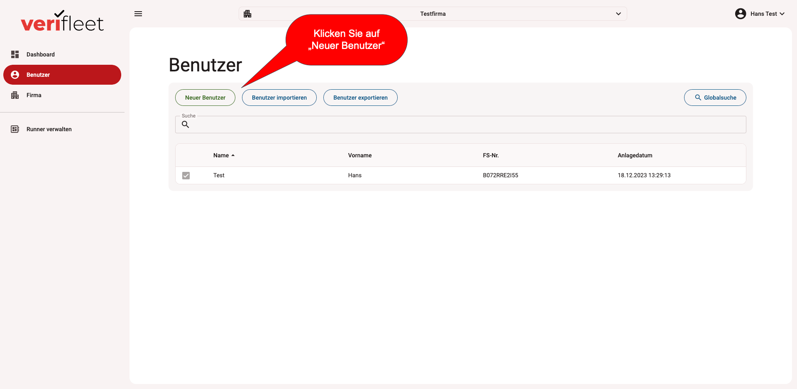
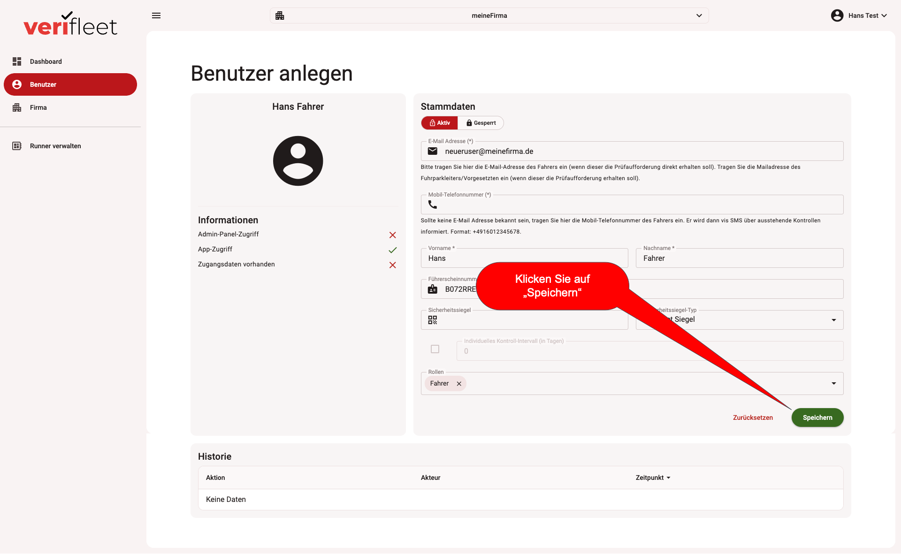

# Erste Schritte

Bitte beachten Sie, dass - wenn Sie sich über die Selbstregistrierung registriert haben -
Ihre Firma bereits angelegt ist und Sie sich nach dem Anmelden im Kontext dieser Firma befinden.

Kontext bedeutet, dass sich alle Anzeigen auf dem DashBoard auf die Firma beziehen, die ganz oben
mittig in der Applikation angezeigt wird.

## Der Bildschirmaufbau

### DashBoard

Das DashBoard hat verschiedene Bereiche, in denen Sie die wichtigsten Informationen zum Zustand des
Systems und der
Kontrollen finden. Die Bereiche sind auf dem Bild unten markiert und werden im Folgenden erläutert.

{ border-effect="line" thumbnail="true" width="500"}

### 1. Firmensuche / -auswahl

Klicken Sie auf die Firmensuche / -auswahl, um eine Firma auszuwählen. Es öffnet sich ein Dialog,
in dem alle von Ihnen angelegten Firmen hierarchisch dargestellt werden. Durch klicken auf einen
Eintrag wählen Sie die Firma aus. Die ausgwählte Firma wird danach in der Suchleiste am oberen
Bildschirmrand angezeigt. Alle Detaildaten auf dem DashBoard und die weiteren Anzeigen, die über das
Menü aufgerufen werden können, beziehen sich nun auf die ausgewählte Firma.

### 2. Menü

Auf der linken Seite des Bildschirms finden Sie das Menü. Über das Menü können Sie alle zur Verfügung
stehenden Anzeigen aufrufen. Der Umfang des Menüs, kann je nach Berechtigung des angemeldeten
Benutzers
unterschiedlich sein.

### 3. Globale Benutzersuche

Mit Hilfe der globalen Benutzersuche können Sie unabhängig davon, welche Firma aktuell ausgewählt
ist,
einen Benutzer suchen der in einer Ihrer Firmen angelegt ist. Klicken Sie dazu auf den Button "globale
Benutzersuche" und geben Sie in dem sich öffnenden Dialog die Suchkriterien ein. Dabei reicht
es auch,
wenn Sie nur einen Teil des Namens, der Mailadresse oder der Führerscheinnummer eingeben. Als
Ergebnis
wird eine Liste mit Benutzern angezeigt, auf die die Kriterien zutreffen. Klicken Sie auf den
Benutzer
in der Liste, um in die Detail-Ansicht zu dem gewünschten Benutzer zu gelangen.

### 4. DataSwitch

Der DataSwitch ermöglicht das Umschalten des DashBoards zwischen der Betrachtung einer einzelnen (der
aktuell ausgewählten) Firma und der kumulativen Betrachtung der DashBoard-Auswertungen aller Ihrer
Firmen.
Klicken Sie auf dem Schalter, um die Ansicht umzuschalten und zu sehen, wie viele Fahrer in der
aktuell
ausgewählten Firma bzw. in allen Ihren Firmen angelegt sind / Kontrollen im aktuellen Monat /
ausstehende und
versäumte Kontrollen stattgefunden haben.

### 5. Kennzahlen

Die Kennzahlen im oberen Bereich der Applikation geben Ihnen einen schnellen Überblick über den
Status der Führerscheinprüfung und ev. Probleme.

!!! note
    Mit einem Klick auf "Angelegte Fahrer" und "Versäumte Kontrollen"
    können Sie direkt in die Benutzerliste bzw. zur
    Liste der versäumten Kontrollen
    springen. VORAUSSETZUNG: Sie befinden sich im Modus "Firma"
    *nicht*
    im Modus "Alle"

### 6. Kontroll-Übersicht

Die Statistik-Grafik, gibt Ihnen einen Überblick, wie viele Kontrollen in den Quartalen des Jahres
durch Ihre Benutzer durchgeführt wurden.

### 7. Liste versäumter Kontrollen

Diese Liste zeigt alle Benutzer an, die Ihre geplante Kontrolle noch nicht durchgeführt haben. Diese
fahrer werden
nach 7 Tagen wiederholt zur Prüfung aufgefordert und Sie erhalten als Fuhrparkleiter parallel eine
Info per Mail.
Durch Klick auf einen Benutzer, können Sie in dessen Detaildaten springen.

### 8. Liste fehlende Kontrollmerkmale

Die Liste fehlende Kontrollmerkmale zeigt Benutzer an, für die weder eine Führerscheinnummer noch
eine Siegelnummer
in den Daten gepflegt ist. Dies führt dazu, dass diese Fahrer keine Aufforderung zur
Führerscheinkontrolle erhalten.
Klicken Sie auf den Benutzer, um in dessen Detaildaten zu gelangen und pflegen Sie die notwendigen
Daten schnellstmöglich
nachträglich ein. Sobald ein Fahrer "prüfbar", erhält er vom System automatisch eine
Aufforderung zur
Führerscheinkontrolle.

!!! warning
    Benutzer die "nicht prüfbar" oder "nicht erreichbar" sind, erhalten keine
    Aufforderungen vom System! Ein Benutzer muss mindestens eine EMail-Adresse oder eine
    Mobilnummer in seinen Daten hinterlegt haben, damit er eine Aufforderung erhalten kann.

    Darüber hinaus muss ein Benutzer mindestens ein Prüfmerkmal (Führerscheinnummer oder
    Siegelnummer haben, damit er eine Prüfaufforderung vom System erhält.

### 9. Liste durchgeführter Kontrollen

Die Liste durchgeführter Kontrollen gibt einen Überblick darüber, welche Benutzer zuletzt eine
Führerscheinkontrolle durchgeführt haben.

## Listen-Ansichten

Listenansichten erlauben Ihnen einen schnellen Überblick über viele Datensätze.
Sie können die Listen sortieren, indem Sie auf die Spaltenüberschrift klicken.
Um in der Liste zu suchen, geben Sie den gesuchten Text in das Suchfeld oberhalb der Liste ein.

Um einen neuen Datensatz anzulegen klicken Sie oben links, oberhalb der Liste auf den Button "+ Neuer
Benutzer,etc.".

{ border-effect="line" thumbnail="true" width="500"}

Falls es für den betrachteten Datenbereich ein Import-/Export-Funktion gibt, kann diese über die Buttons
oberhalb der Liste gestartet werden. Ebenfalls findet sich dort (falls verfügbar) ein Button für die
Globalsuche. Damit wird ein Suchfenster geöffnet, mit dem Sie z.B. auch Fahrer ausserhalb der aktuell
ausgewählten Firma suchen können.

## Detail-Ansichten

Die Detail-Ansicht eines Datensatzes erlaubt es Ihnen alle Daten in diesem Bereich zu pflegen.

!!! note
    **WICHTIG:**

    Klicken Sie - nachdem Sie alle erforderlichen Änderungen an einem Datensatz vorgenommen haben -
    unbedint auf den Button "Speichern", der sich unten rechts an den Detail-Ansichten befindet.
    Ansonsten gehen die erfassten Daten verloren.

Neben der Erfassung von Daten können im Detail-Bereich auch Aktionen ausgelöst werden, die nur diesen
Benutzer betreffen (z.B. eine Führerscheinkontrolle manuell anfordern). Ebenso können in diesem Bereich
Rechte für den Benutzer vergeben werden oder im Bereich der Firmen die Anbindung an ein führendes System
definiert werden (z.B. Carano).

!!! tip
    Geben Sie Benutzern nur die wirklich notwendigen Berechtigungen. Benutzer, die nicht erfahren genug
    sind haben sonst ev. die Möglichkeit ihr System zu beschädigen.

## Eine Firma anlegen

### 1. Anmelden

Melden Sie sich am System an, so dass Sie das DashBoard sehen.

{ border-effect="line" thumbnail="true" width="500"}

### 2. Firma (aktuelle) aufrufen

Klicken Sie links im Menü auf "Firma", um die Stammdaten der aktuellen Firma anzuzeigen.

{ border-effect="line" thumbnail="true" width="500"}

### 3. Neue (Sub-)Firma anlegen

Klicken Sie in der View - in der die Daten der aktuellen Firma angezeigt werden - unten auf "Sub-Firma
anlegen".

Damit wird eine neue Firma unterhalb der aktuellen Firma erzeugt.

{ border-effect="line" thumbnail="true" width="500"}

### 4. Daten der neuen Firma erfassen

Geben Sie die Daten für die neue Firma möglichst vollständig ein (Name, Straße, PLZ, Ort, EMail).

!!! warning
    **WICHTIG:**

    Lassen Sie weitere Felder - die Ihnen abhängig von Ihren Berechtigungen angezeigt
    werden - frei.
    Diese werden später detailliert behandelt.

!!! note
    **HINWEIS:**

    Sollten Sie Pflichtfelder nicht füllen, werden Sie vom System durch eine Meldung darauf
    hingewiesen.

{ border-effect="line" thumbnail="true" width="500"}

### 5. Speichern der neuen Firma

Klicken Sie rechts unten auf den Button "Speichern", um die neue Firma zu speichern.

{ border-effect="line" thumbnail="true" width="500"}

!!! tip
    Weiterführende Informationen zur Verwaltung von Firmen finden Sie unter [Firmenverwaltung](../Companies/company-management.md).

## Fahrer anlegen

### 1. Benutzer-Liste aufrufen

Klicken Sie nach dem Anmelden links im Menü auf den Eintrag "Benutzer".

{ border-effect="line" thumbnail="true" width="500"}

### 2. Neuen Benutzer anlegen

Es wird die Benutzer-Liste angezeigt. Falls noch keine Benutzer existieren ist diese leer.
Klicken Sie oberhalb der Liste auf den Button "Neuer Benutzer".

{ border-effect="line" thumbnail="true" width="500"}

### 3. Daten des neuen Benutzers erfassen

Erfassen Sie alle erforderlichen Daten des neuen Benutzers (Vorname, Nachname, EMail oder
Mobilnummer).

!!! warning
    **WARNUNG:**

    Wenn Sie einen "Aktiven" Fahrer anlegen (siehe Button oben auf der Fahrer-View), erhält
    dieser sofort
    nach dem Speichern eine Aufforderung zur Durchführung einer Kontrolle.

    <control>Sollten Sie dies nicht wünschen, setzen Sie den Fahrer zunächst auf "Gesperrt"!
    </control>

!!! note
    **HINWEIS:**

    Sollten Sie Pflichtfelder nicht füllen, werden Sie vom System durch eine Meldung darauf
    hingewiesen.

{ border-effect="line" thumbnail="true" width="500"}

### 4. Speichern des neuen Benutzers

Klicken Sie unten rechts auf Speichern, um den Fahrer zu speichern.

{ border-effect="line" thumbnail="true" width="500"}

Nachdem der Benutzer gespeichert wurde, wird dieser in der Benutzerliste angezeigt.