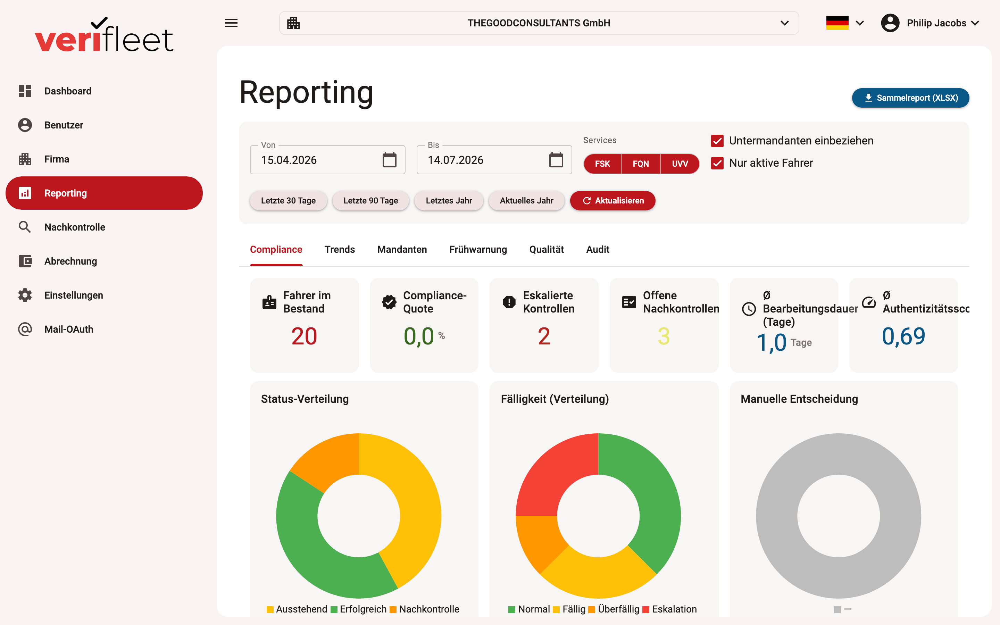

# Reporting

Reporting gives you comprehensive analytics across all checks, drivers and companies in
your area of responsibility. You reach it via the **Reporting** entry in the left-hand
menu.

{ border-effect="line" thumbnail="true" width="100%" }

!!! note
    The menu entry is only visible if your user has the company-management or reporting
    permission.

## Filters

Above the analytics you define which data is evaluated:

- **Period** — the evaluation period for all charts and KPIs.
- **Services** — restrict to individual check types (driving licence, UVV, DQC).
- **Companies** — evaluate the currently selected company with or without its
  sub-companies.

## The analytics tabs

### Compliance

Key figures at a glance: number of drivers, compliance rate, escalated checks and open
follow-up checks. Plus the distribution of due states, the outcomes of manual follow-up
checks and a compliance bar per booked service.

### Trends

Development over time: checks per month (stacked by check type), a process funnel from
"requested" through "completed" to "manually approved", the most frequent licence classes
and issuing countries, and an activity heatmap by weekday and hour.

### Quality

Performance of the manual reviewers (number and outcome distribution of follow-up checks)
and the distribution of factors flagged by the automatic document check.

### Early warning

Forward-looking lists: driving licences expiring within the next 30/60/90 days, a combined
escalation list across all check types, and at-risk drivers with repeated aborts or missed
checks.

### Audit

The system's action history for the selected period, filterable by action type and acting
user — including a chart of the action distribution.

### Tenants

Comparison table of all sub-companies with driver count, open and escalated checks and
compliance percentage. Clicking a row opens the profile of that tenant.

## Export

The **"Collective report (XLSX)"** button in the top right downloads all analytics as one Excel
workbook — one worksheet per evaluation.
