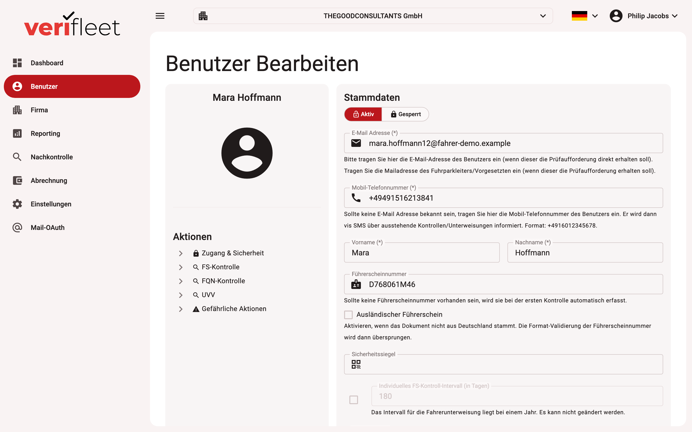

# Editing a user

This guide describes how to edit and manage existing users.

## Navigation path

1. **Left sidebar** > **Users**
2. Select an existing user from the list

{ border-effect="line" thumbnail="true" width="100%" }

## Editing master data

### Status

- **Active / blocked**: enables the user or blocks access.

### Fields and options

| Field | Description |
|-------|-------------|
| **E-mail address** | For communication and check requests. |
| **Mobile phone number** | For SMS notifications. International format with country code, e.g. `+4916012345678` — spaces, dashes and brackets are removed automatically, a leading `00` becomes `+`. |
| **Preferred contact channel** | Determines whether check requests are sent by **email** or **SMS**. **Default (company)** uses the company's default contact channel (see [Editing a company](../Companies/company-edit.en.md#advanced-settings)). If the chosen channel cannot be used (e.g. SMS without a phone number), the system falls back to the other channel. |
| **First / last name** | Full name of the user. |
| **Licence number** | Captured automatically during the next check. |
| **Individual licence-check interval** | If this driver's check interval differs from the company default, enable and set it in days. The instruction (UVV) interval is fixed at one year. |
| **Date of birth** | For documentation and verification purposes. |
| **Department / employee ID** | Optional extra data. |
| **Security seal** | 14-character identifier of an NFC seal — see [NFC seals](user-nfc-tags.md). |
| **Foreign driving licence** | Enable if the document is not German — the licence-number format validation is then skipped. |
| **Roles** | Multiple selection possible (e.g. `driver`, `fleet manager`, `Carano import`, `follow-up check`, plus custom roles). |

**Actions:**

- **Reset**: discards all changed entries.
- **Save**: persists the changes.

## Actions (side menu)

Special categories that can be triggered or reviewed for the user:

- **Access & security** (e.g. set/reset password)
- **Licence check** (manually request a driving-licence check)
- **FQN check** (request a qualification-card check)
- **UVV** (request an instruction)
- **Dangerous actions** (e.g. delete user, move to another company)

## Checks / instructions

Shows the user's check history:

| Status | Type | Due | Completed | Scheduled |
|--------|------|-----|-----------|-----------|
| ✔️ Done | DLC | 13.03.2025 | 13.03.2025 07:02:41 | 13.03.2025 07:02:41 |
| ❌ Aborted | DLC | overdue | – | 25.02.2025 17:23:09 |
| … | … | … | … | … |

**Note:** the table is paginated. Due-state types such as "normal" and special states are
highlighted.

---

## History

Lists past actions concerning the user:

| Action | Actor | Time |
|--------|-------|------|
| DLC manually attempted | Support Team1 | 13.03.2025 07:02:41 |
| Request sent again | Support Team1 | 12.03.2025 09:15:10 |
| UVV automatically requested | User | 07.03.2025 15:06:03 |
| Signed in | User | 25.02.2025 17:23:56 |
| … | … | … |

Paginated; serves as a transparent trail of all changes and system actions.

---

When an existing check request is delivered again (from the interface or via the API), the entry **"Request sent again"** appears with delivery details:

| Detail | Meaning |
|--------|---------|
| **Check type** | Driving licence check, qualification check (FQN) or instruction (UVV) |
| **Delivery** | *Delivered immediately*, *Delivered later by job* (sent with the next automatic run) or *Sending disabled* |
| **Channel / Recipient** | Email or SMS and the address or number used |
| **Triggered via** | Interface or API |

A waiting period of 15 minutes applies between two repeated deliveries to the same driver.

## General notes

- Fields marked with an asterisk (*) are mandatory. For email and mobile phone number, **one** of the two contact routes is sufficient — at least one must be present.
- Data such as licence numbers or intervals may be processed automatically.
- Multiple roles can be assigned.
- Check the **Checks / instructions** tab regularly to stay within deadlines.
