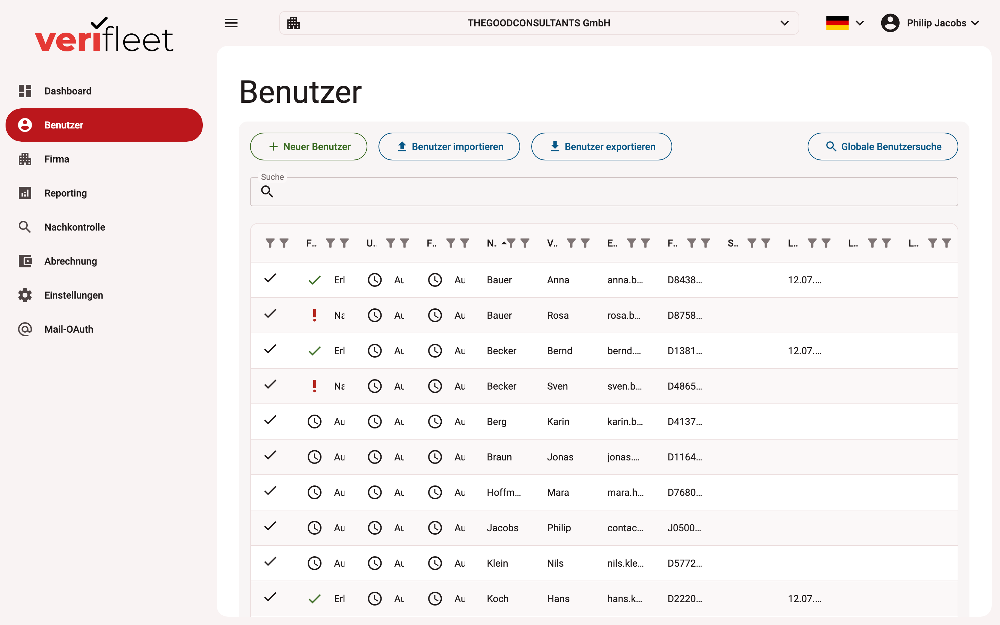

# User list

The **Users** area manages all drivers and users of your fleet. Here you can create new
users, view, check and export existing data.

{ border-effect="line" thumbnail="true" width="100%" }

## Overview of the user list

The table shows all registered users with the relevant information:

| Column | Description |
|--------|-------------|
| **DLC** | Driving-licence check status (✓ done / ⏱ pending) |
| **Last name / first name** | Name of the user |
| **E-mail** | Contact address |
| **Licence number** | Number of the stored driving licence |
| **Seal no.** | Seal number of the most recently checked licence |
| **Last check** | Date and time of the last performed check |

## Functions at a glance

### Adding a user

Click **"+ New user"** to create a new driver/user, entering name, contact data and — if
available — licence information.

### Importing users

Use the **"Import users"** button to upload a list of users from a file (Excel).

### Exporting users

**"Export users"** downloads all existing user data for further processing.

### Global user search

The **global search** at the top right finds users across companies by name, e-mail
address or licence number.

## Filtering and sorting

- Sort the table via the column headers (e.g. by last name).
- The licence-check status is visualised with icons and colours.

## Pagination

At the bottom of the table you can page through the results; the current page and total
number of users are displayed.

## Notes

- **Pending checks** should be reviewed and followed up regularly.
- A licence check can be initiated or documented from a user's detail view.
- User management is closely linked to the **follow-up check** function, which implements
  the specific review cycles.
