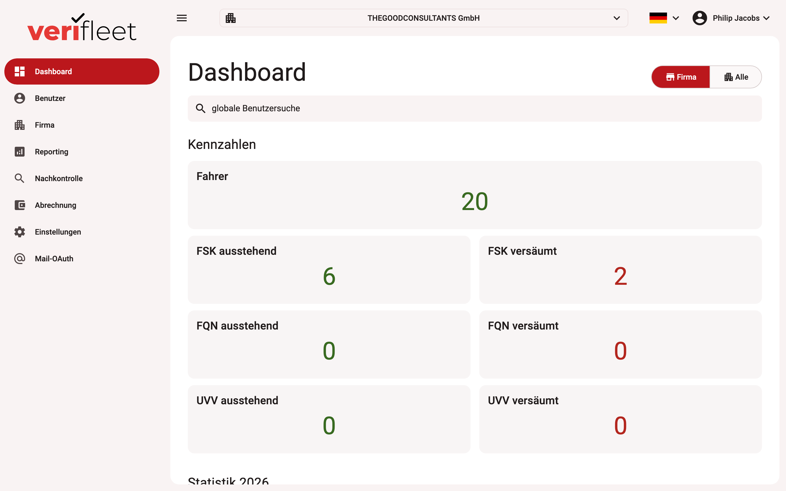

# Home

Our system is a digital driving-licence check for your fleet. Its algorithm is based on an
AI-supported system to give you the highest level of assurance when checking your
employees' driving licences.

{ border-effect="line" thumbnail="true" width="100%" }

- :fontawesome-solid-rocket:{ .icon-xxl .icon-grey }
    

    __First steps__  
    Learn the quickest way to set up your company and drivers.
    

- :fontawesome-solid-list:{ .icon-xxl .icon-grey }
    

    __Glossary__  
    An overview of all important functions of the system.
    

## Features

- :fontawesome-solid-address-card:{ .icon-xxl .icon-grey }
    

    __Card driving licences__  
    AI integration enables not only more efficient licence verification but also the
    recognition of specific features, including holographic elements.
    

- :fontawesome-solid-map:{ .icon-xxl .icon-grey }
    

    __Old driving licences (seal check)__  
    Automated checks based on tamper-proof seals introduce improved verification that
    maximises protection against misuse.
    

- :fontawesome-solid-graduation-cap:{ .icon-xxl .icon-grey }
    

    __UVV__  
    The app also covers the UVV driver instruction — maximum safety with minimal effort.
    

- :fontawesome-solid-id-badge:{ .icon-xxl .icon-grey }
    

    __Driver qualification card (DQC)__  
    Professional drivers' qualification proof (code 95) is checked automatically, with
    early warning before expiry.
    

- :fontawesome-solid-chart-line:{ .icon-xxl .icon-grey }
    

    __Reporting__  
    Compliance, trends, quality, early warning and audit — all analytics exportable to
    Excel.
    

- :fontawesome-solid-arrow-right-to-bracket:{ .icon-xxl .icon-grey }
    

    __No login__  
    Drivers can start any kind of check without signing in. Fewer passwords = fewer
    problems = fewer support requests!
    

- :fontawesome-solid-comment-sms:{ .icon-xxl .icon-grey }
    

    __SMS__  
    Drivers without an e-mail account can be requested to perform their check via SMS.
    

- :fontawesome-solid-plus:{ .icon-xxl .icon-grey }
    

    __Self-registration__  
    During the first check, all data required for driver registration can be captured at
    the same time — less manual data entry, fewer errors.
    

## Get started

- <a href="../Companies/company-management/"> :fontawesome-solid-building:{ .icon-xxl .icon-grey }
    

    __Companies__  
    Learn how to set up and manage companies and company structures.
    

</a>
- <a href="../Users/user-management/"> :fontawesome-solid-users:{ .icon-xxl .icon-grey }
    

    __Users/drivers__  
    Learn how to create and manage users in the system.
    

</a>
- :fontawesome-solid-user-check:{ .icon-xxl .icon-grey }
    

    __Planning/requesting checks__  
    Learn how to plan or request checks automatically or manually.
    

- :fontawesome-solid-chart-line:{ .icon-xxl .icon-grey }
    

    __Dashboard__  
    Learn how to spot problems on the dashboard and identify the affected drivers.
    

