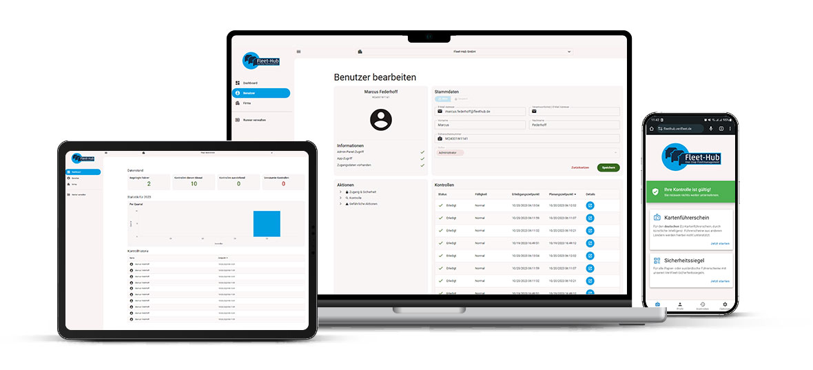

# Start

Unser System ist eine digitale Führerscheinkontrolle für Ihren Fuhrpark. Der Algorithmus basiert auf einem KI gestützten System, um Ihnen höchste Sicherheit bei der Führerscheinkontrolle Ihrer Mitarbeiter zu bieten.

{ border-effect="line" thumbnail="true" width="100%" }

- :fontawesome-solid-rocket:{ .icon-xxl .icon-grey }
    

    __Erste Schritte__  
    Erfahren Sie, wie Sie auf dem kürzesten Weg Ihre Firma und Fahrer einrichten.
    

- :fontawesome-solid-list:{ .icon-xxl .icon-grey } 
    

    __Glossar__   
    Hier finden Sie eine Übersicht über alle wichtigen Funktionen des Systems.
    

## Features

- :fontawesome-solid-address-card:{ .icon-xxl .icon-grey }
    

    __Kartenführerscheine__  
    Die Integration von KI-Systemen ermöglicht nicht nur eine effizientere Überprüfung von Führerscheinen, sondern auch die Erkennung von spezifischen Merkmalen und sogar die Identifikation von holografischen Elementen.
    

- :fontawesome-solid-map:{ .icon-xxl .icon-grey } 
    

    __Alte Führerscheine (Siegelkontrolle)__   
    Mit dem Einsatz automatisierter Kontrollsysteme, die auf fälschungssicheren Siegeln basieren, wird eine verbesserte Überprüfung eingeführt, die den Schutz vor Missbrauch maximiert.
    

- :fontawesome-solid-graduation-cap:{ .icon-xxl .icon-grey } 
    

    __UVV__   
    Unsere App bietet Ihnen ebenfalls die Möglichkeit, die UVV Prüfung über die App abzubilden. Das bedeutet maximale Sicherheit und minimaler Aufwand.
    

- :fontawesome-solid-arrow-right-to-bracket:{ .icon-xxl .icon-grey } 
    

    __Ohne Login__   
    Der Fahrer kann jede Art der Prüfung starten ohne sich anmelden zu müssen. Weniger Passwörter = weniger Probleme = weniger Nachfragen!
    

- :fontawesome-solid-comment-sms:{ .icon-xxl .icon-grey } 
    

    __SMS__   
    Falls Ihre Fahrer nicht über eigene Mail-Accounts verfügen, über die Sie sie zur Prüfung auffordern können, kein Problem. Mit Hilfe der SMS-Funktion, können Sie Ihre Fahrer auch per SMS zur Prüfung auffordern.
    

- :fontawesome-solid-plus:{ .icon-xxl .icon-grey } 
    

    __Selbstregistrierung__   
    Eine neue Funktion in unserer App erlaubt es, bei der ersten Kontrolle gleichzeitig alle für die Fahrerregistrierung erforderlichen Daten zu erfassen. Dadurch müssen weniger Daten manuell erfasst werden und es passieren weniger Fehler.
    

## Get started

- <a href="/Companies/">
    :fontawesome-solid-building:{ .icon-xxl .icon-grey }
    

    __Firmen__  
    Lernen Sie, wie Sie Firmen und Firmenstrukturen einrichten und managen.
    

  </a>
- <a href="/Users/">
    :fontawesome-solid-users:{ .icon-xxl .icon-grey } 
    

    __Benutzer/Fahrer__   
    Lernen Sie, wie Sie Benutzer im System einrichten und verwalten    
    

    :fontawesome-solid-user-check:{ .icon-xxl .icon-grey }
    

    __Kontrolle planen/anfordern__  
    Lernen Sie, wie Sie Kontrollen automatisch oder manuell planen bzw. anfordern.
    

    :fontawesome-solid-chart-line:{ .icon-xxl .icon-grey } 
    

    __Dashboard__   
    Lernen Sie, wie Sie auf dem DashBoard Probleme erkennen und die betroffenen Fahrer identifizieren.
    

## Weitere relevante Themen